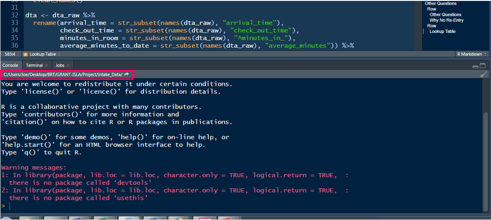

```{r setup, include=FALSE}

library(tidyverse)
library(knitr)
library(here)
library(kableExtra)
library(janitor)
library(rio)

```

## Hex stickers!

Let's give Xinyu a hex sticker!


## Hex stickers!

And let's give Cheyna a hex sticker for sharing today!

. . .


## Share out

Custom Editor theme!

## Housekeeping

- Slides as pdf
- Screenshots
  - Something to show you completed the Codecademy lesson in its entirety
  - Only responsible for the free Lessons

:::: {.columns}

:::
{width=30%}
:::

:::
{width=30%}
:::

::::
# Workflow

Week 2

## Agenda {.smaller}

-   Project Oriented Workflow
    -   RStudio Projects
    -   File paths
    -   Reading in data
    -   Scripts (.R & .qmd)
    -   Loading packages
-   Looking at data
-   The pipe `|>`
    -   also `%>%`

**Learning Objectives**

-   Open an RStudio Project
-   Understand file paths
-   Learn two ways to read data
-   Establish good workflow habits

# RStudio Projects

## RStudio Projects (.Rproj)

An RStudio project - .Rproj - is basically a folder to house all the files for your project

-   scripts
-   products
-   data
-   figures

## RStudio Projects (.Rproj)

**Advantages**

-   Work with several projects at the same time (several projects open)
    -   these are self-contained!
-   Can save the history of your commands after quitting
-   Can specify version control system (e.g., Git)
-   Previously edited code tabs are restored upon opening
-   The current **working directory** is set to the project directory

## What's a working directory? {.smaller}

Where you're at on your computer

-   the folder location
-   *Quick check-in*: does this make sense?

. . .

You *can* change your working directory with `setwd("path/to/files")`...

...**BUT** I strongly urge you to avoid that

. . .

Instead, we're going to use RStudio Projects and the `{here}` package

. . .

-   See where you're currently at by looking at the top of the console
-   Or run `getwd()` in the console



## What's different with .Rproj?

Your working directory is immediately wherever your `.Rproj` project is located

This is true for whoever is accessing the project

Use the `{here}` package to specify **paths**

-   You can read/save data (and figures, products, etc.) which we'll talk about more later

## Best practices {.smaller}

:::: columns
::: {.column width="50%"}
`here()`

-   works for anyone who uses the script
-   share it out with no code editing
-   easy to work on other projects with different directories
:::

::: {.column width="50%"}
**Session \> Restart R** (`Ctrl/Command + Shift + F10`)

Restart the `R` session

-   Create a fresh `R` process
-   Deletes **all** objects
-   Packages will need to be re-loaded
-   Resets any code-enables options
-   Ensures script is self-contained
:::
::::

## Project Oriented Workflow

Write every script assuming it will be run in a fresh `R` process

. . .

1)  Do not save `.RData` when you quit `R` and don't load `.RData` when you start `R`

{width=30%}

Week 1: **Tools 🡆 Global Options 🡆 General**

Workspace

-   "*Restore .RData into workspace at startup*" -- **Uncheck**
-   "*Save workspace to .RData on exit:*" -- **Never**

## Project Oriented Workflow

Write every script assuming it will be run in a fresh `R` process

2)  Daily work habit:

-   Restart `R` very often and re-run your developing script from the top
-   Use the RStudio menu item: **Session \> Restart R** (`Ctrl/Command + Shift + F10`)

# Workflow

## Let's start by making a new project

Typical workflow

1.  Make a new .RProj

2.  Add folders

    -   "data"
    -   "scripts"

3.  Read in data

4.  Create scripts

5.  Load packages

# RStudio Project

## 1. Make a new .RProj

*File* \> *New Project...*

or - upper right of RStudio by the `R` cube

⬇️ \> *New Project...*

## 1. Make a new .RProj {.smaller}

Let's name it: "my_first_project"

-   notice the naming convention
    -   no caps
    -   no spaces
    -   no special characters (e.g., `?`, `!`, `"`, `#`)
    -   "`_`" and "`-`" are ok

. . .

Choose a location for it

-   An .RProj will need its own folder, with no other projects in it!
-   Projects in Dropbox often lead to unexpected occurences

. . .

I'll just save "my_first_project" to my desktop

[**demo**]{style="color:#D55E00;"}

# Organize

## 2. Create folders

Let's make two folder in different ways (either is fine)

**"data"**

-   where we will store all our project-related data
-   let's create that in Rstudio

**"scripts"**

-   where we will hold all our scripts (.R or .Rmd or .qmd files)
-   let's create that in the folder on our machine

[**demo**]{style="color:#D55E00;"}

# Reading Data

## Dowload data

Let's save the following data files into our project "data" folder

(*go [here](https://jnese.github.io/intro-DS-R_fall-2025/data_list.html) to download*)

1.  ecls-k_samp.sav
2.  Fatality.txt
3.  Project_Reads_Scores.csv

## Let's see files are in our "data" folder

- You can `list.files("path/to/files")` to see the contents of your project directory (i.e., what your computer "sees")
  + `list.files(here("data"))`
- You can also use the *Files* tab in RStudio

. . .

- Use `here()` to access data or any file in your project

. . .

- `here()` is simply a function to print a path

. . .

[**demo**]{style="color:#D55E00;"}

## Reading data into `R`

You just need two things:

1.  **where** the data is located

This is most often just a path on you machine

. . .

2. `package::function()` to read the data 

We'll be talking about two data reading packages

- `{rio}`
- `{readr}`

## We'll use the `{here}` package {fig-align="right" width="10%"} {.smaller}

`{here}` uses the top-level directory of a project to easily build **paths** to files

-   Allows you to worry about paths a little less
-   Helps reproducibility
-   Your final project!

Think of `here()` simply as a function to print a path name

A **path** can be the **location** of your data

::: aside
Art: [Allison Horst](https://www.allisonhorst.com/)
:::

. . .

**path** = **location**

## [`{here}`](https://here.r-lib.org/)

Think of `here()` simply as a function to print a path name

First, install/load the package

```{r}
#| echo: true

# In the console: 
# install.packages("here")
# Then, load the package

library(here)
```

## [`{here}`](https://here.r-lib.org/)

Think of `here()` simply as a function to print a path name

Run this code in your project (console is fine)

```{r}
#| echo: true

here()
```

. . .

This is the "top level" directory of **my** project

## [`{here}`](https://here.r-lib.org/)

Think of `here()` simply as a function to print a path

Run this code in your project (console is fine)

```{r}
here()
```

**This is the path to the project directory**

. . .

```{r}
#| eval: false
here("data")
```

. . .

```{r}
#| echo: false
here("data")
```

This is the path to the "data" folder in our project directory

## [`{here}`](https://here.r-lib.org/) {.smaller}

Think of `here()` simply as a function to print a path

```{r}
here()
```

```{r}
here("data")
```

**Question:** What was the difference in the output between these?

. . .

**Question:** What will the following produce?

```{r, eval=FALSE}
here("data", "ecls-k_samp.sav")
```

. . .

```{r}
#| echo: false
here("data", "ecls-k_samp.sav")
```

# Reading Data

## `{rio}`

-   `{rio}` is a wrapper around many different packages that import/export data in different formats

-   Great package

-   Most of the time "it just works" regardless of the source file type

    -   this might not impress you, but it really should!
    -   any package that turns a complex task into a simple procedure that "just works" is invaluable

## [`rio::`import()`](https://cran.r-project.org/web/packages/rio/vignettes/rio.html) {.smaller}

<p>

[import]{style="color:#0072B2"}([file]{style="color:#D55E00"}, [format]{style="color:#CC79A7"}, [setclass]{style="color:#009E73"}, ...)

[file]{style="color:#D55E00"} = character string naming a file

. . .

[format]{style="color:#CC79A7"} = (*optional*) character string of file format; e.g., `","` for comma-separated values

[setclass]{style="color:#009E73"} = (*optional*) character vector specifying one or more classes to set on the import. Default is `"data.frame"`. We would probably prefer `"tbl_df"` for a `tibble`

</p>

## [`rio::`import()`](https://cran.r-project.org/web/packages/rio/vignettes/rio.html) {.smaller}

<p>

[import]{style="color:#0072B2"}([file]{style="color:#D55E00"}, [format]{style="color:#CC79A7"}, [setclass]{style="color:#009E73"}, ...)

[file]{style="color:#D55E00"} = character string naming a file

## 3a. Read in data

Try it!

```{r}
#| code-line-numbers: "|5|10,11|14,15"

library(rio)
#library(tidyverse)

# .sav
eclsk <- import(here("data", "ecls-k_samp.sav"), setclass = "tbl_df")

# Use `as_tibble` instead of `setclass = "tbl_df"`

# .txt
fatality <- import(here("data", "Fatality.txt")) |> 
  as_tibble()

#.csv
exam1 <- import(here("data", "Project_Reads_Scores.csv")) |> 
  as_tibble()

```

## You can even read directly from the web 😲

Fatality.txt

```{r}
import("https://raw.githubusercontent.com/jnese/intro-DS-R_fall-2025/master/data/Fatality.txt",
       setclass = "tbl_df")
```

## Write data {.smaller}

Save data just as easily with [`rio::export()`](https://cran.r-project.org/web/packages/rio/vignettes/rio.html)

. . .

You need two things:

<p>

1.  [What]{style="color:#009E73"} to export?
2.  [Where]{style="color:#D55E00"} to export?

. . .

[export]{style="color:#0072B2"}([x]{style="color:#009E73"}, [file]{style="color:#D55E00"}, [format]{style="color:#CC79A7"}, ...)

[x]{style="color:#009E73"} = data frame (tibble) to be written into a file

[file]{style="color:#D55E00"} = character string naming a file

</p>

. . .

```{r, eval=FALSE}
export(fatality, here("data", "exam1.sav"))

export(fatality, here("data", "exam1.txt"))

export(fatality, here("data", "exam1.dta"))
```

## `convert()` {.smaller}

Another really useful feature is `convert()`, which just takes a file of one type and converts it to another

Say your advisor uses SPSS 😐, but their colleague uses Stata 😐, and you use `R` 😎

Just run one line of code!

<p>

. . .

[convert]{style="color:#0072B2"}([in_file]{style="color:#009E73"}, [out_file]{style="color:#CC79A7"}, ...)

. . .

[in_file]{style="color:#009E73"} = character string naming an input file

. . .

[out_file]{style="color:#CC79A7"} = character string naming an output file

. . .

[convert]{style="color:#0072B2"}([here("data", ecls-k_samp.sav]{style="color:#009E73"}), [here("data", ecls-k_samp.txt]{style="color:#CC79A7"}))

</p>

## How is this all working? {.smaller}

`{rio}` wraps a variety of faster, more modernized packages than those provided by base `R`

-   `{data.table}` for delimited formats
-   `{readxl}` and `{openxlsx}` for reading and writing Excel workbooks
-   `data.table::fread()` for text-delimited files to automatically determine the file format regardless of the extension
    -   also *very* fast

. . .

Again, `import()` "just works"

## Maintaining data "labels" {.smaller}

**Question: How many of you or your colleagues use SPSS or Stata?**

**and/or: How many of you use Qualtrics?**

. . .

In SPSS, Stata, & Qualtrics numeric data are often encoded with labels

For SAS, Stata, and SPSS files use `{haven}`

`{haven}` allow you to transform the data into the character/factor version

`{haven}` store metadata from rich file formats (SPSS, Stata, etc.) in variable-level attributes in a consistent form regardless of file type or underlying import function

. . .

-   `rio::characterize()` converts a single variable or all variables in the data that have *label* attributes into character vectors
-   `rio::factorize()` does the same but returns factor variables

. . .

**This is <u>very</u> important for several of your homeworks!**

## 

```{r}
eclsk |>
  select(child_id, k_type:sex) 
```

## 

```{r}
#| code-line-numbers: "|2"
#| output-location: fragment

eclsk |>
  characterize() |>
  select(child_id, k_type:sex) 
```

## [`{readr}`](https://readr.tidyverse.org/) {.smaller}

-   Great package; most of the time "it just works" regardless of the source file type
-   Loads with `{tidyverse}`
-   Default loads data as a `tibble`
    -   this is nice!

. . .

-   [`read_csv()`](https://readr.tidyverse.org/reference/read_delim.html): comma separated (CSV) files
-   [`read_tsv()`](https://readr.tidyverse.org/reference/read_delim.html): tab separated files
-   [`read_delim()`](https://readr.tidyverse.org/reference/read_delim.html): general delimited files
-   [`read_fwf()`](https://readr.tidyverse.org/reference/read_fwf.html): fixed width files
-   [`read_table()`](https://readr.tidyverse.org/reference/read_table.html): tabular files where columns are separated by white-space
-   [`read_log()`](https://readr.tidyverse.org/reference/read_log.html): web log files

## [`read_csv()`](https://readr.tidyverse.org/reference/read_delim.html) {.smaller}

You just need one thing:

1.  [where]{style="color:#D55E00;"} the data is located

[read_csv]{style="color:#0072B2;"}([file]{style="color:#D55E00;"}, ...)

[file]{style="color:#D55E00;"} = a **path** to a file, a connection, or literal data (either a single string or a raw vector)

. . .

**And how do we get a path string?**

. . .

with the `here()` function

```{r}
#| eval: false
read_csv(here("path", "to", "data.csv"))
```

## 3b. Read in data

Try it!

```{r, eval=FALSE}
library(tidyverse)

# read_table() for space separated data
fatality <- read_table(here("data", "Fatality.txt")) 

#read_csv(), the one I most often use
exam1 <- read_csv(here("data", "Project_Reads_Scores.csv"))

# read directly from the web, in this case a .csv
web <- read_csv("https://github.com/datalorax/ncme_18/raw/master/data/pubschls.csv")

```

## [`write_*()`](https://readr.tidyverse.org/reference/index.html) {.smaller}

Save data just as easily with `write_*()`

You need two things:

1.  [What]{style="color:#009E73;"} to export?
2.  [Where]{style="color:#D55E00;"} to export?

. . .

[write_csv]{style="color:#0072B2;"}([x]{style="color:#009E73;"}, [file]{style="color:#D55E00;"}, ...)

[x]{style="color:#009E73;"} = data frame (tibble) to be written into a file

[file]{style="color:#D55E00;"} = character string naming a file to write to

. . .

Basically

`write_*(what, "where")`

```{r, eval=FALSE}
write_csv(exam1, here("data", "exam1.csv"))
```

# Scripts

## .R {.smaller}

.R is `R` script (code) file

*File* \> *New File* \> *R Script*

-   Everything is code
-   Text - comments! - need to begin with "`#`"
    -   Comments are a **great** habit!
    -   Use them to document the what & why of your code

Run code

-   `Ctrl/Command + Enter`
-   Highlight specific code, `Ctrl/Command + Enter`
-   Put mouse on line, `Ctrl/Command + Enter`, and it will execute the all connected (piped) code

[demo]{style="color:#D55E00;"}

## Quick Peek {.smaller}

**What is Quarto?**

- an open-source scientific and technical publishing system
- create dynamic content with Python, R, Julia, and Observable.
- publish reproducible, production quality articles, presentations, websites, blogs, and books in HTML, PDF, MS Word, ePub, etc.
- include equations, citations, crossrefs, figure panels, callouts, advanced layout, etc.
- a multi-language, next generation version of R Markdown (from Posit)
- includes many built in output formats (and options for customizing each)
- has native features for special project types like Websites, Books, and Blogs (rather than relying on external packages)

## Why Quarto?

-   **Reproducibility**: reproducible workflow
    -   Code + output + prose together
    -   Syntax highlighting FTW!
    -   Familiar-feeling authoring with the visual editor without having to learn a bunch of new markdown syntax
-   **Efficiency**: consistent formatting
-   **Extendability**: Use with Python, and Julia, and Observable, and more

## .qmd

.qmd is a document format file that combines code **AND** prose

-   *File* \> *New File* \> *Quarto document...*

. . .

Code goes into **"code chunks"**

```{r}
#| echo: fenced
#| eval: false
# comment

data |> 
  select(id, read, math)
```

. . .

Prose goes outside the code chunks

. . .

[demo]{style="color:#D55E00;"}

## .R & .qmd

-   Both are great
-   Serve different purposes

. . .

Organization tip

-   .qmd with headers
-   .R with `# Header ----`

[demo]{style="color:#D55E00;"}

# Packages

## Packages {.smaller}

. . .

**First** the package must be *installed* on your machine

`install.packages(“package_name”)`

. . .

-   you will only need to do this the first time you want to use the package
-   **never** keep this code line (just run it in the console!)
-   notices the quotes around the package name
-   **never keep this code line**

. . .

Any time you want to use a package it should be *loaded*

`library(package_name)`

. . .

-   you will do this each time you use the package in your scripts
-   notices no quotes around the package name

## [`{janitor}`](https://github.com/sfirke/janitor) {fig-align="right" width="10%"} {.smaller}

A fantastic package!

-   `remove_empty_rows()`
-   `remove_empty_cols()`
-   `excel_numeric_to_date()`
    -   changes numeric dates imported from Excel to actual dates
-   `tabyl()`
    -   frequency table with *n* and *%*

. . .

-   `clean_names()`
    -   styles **column names** (NOT data itself) with "snake_case": lower case and underscore between words
    -   can choose other "`*_case`"

# Let's put it all together

## New script {.smaller}

Let's work within the "my_first_project" .RProj

(1) Open a new Quarto document

[demo]{style="color:#D55E00;"}

## New script {.smaller}

Let's work within the "my_first_project" .RProj

(2) Clean it up
    i) Modify the YAML
    ii) Save the file as "practice.qmd" in the **scripts** folder
    iii) Render!

[demo]{style="color:#D55E00;"}

## New script {.smaller}

- Opens with a template
- Going forward with .qmd...
    1) you can delete everything in the template, **or**
    2) you can open an empty .qmd document
    
**but** do one of these

## Working with data

(1) What packages will we use?

-   `library(here)` - where the data is located
-   `library(rio)` - read the data into `R`
-   `library(janitor)` - clean the **variable names** in the data
-   `library(tidyverse)` - clean the **data**

## Working with data

(2) Read in the [Penguins.csv](https://jnese.github.io/intro-DS-R_fall-2025/data_list.html#penguins.csv) data

-   Let's name the data "*penguins*"
-   Three options, choose one

```{r, results='hide'}
# rio::import()
penguins <- import(here("data", "Penguins.csv"), setclass = "tbl_df")

penguins <- import(here("data", "Penguins.csv"))

# readr::read_csv()
penguins <- read_csv(here("data", "Penguins.csv")) 
```

::: aside
Note that this data is taken from the `{palmerpenguins}` package but has slight modifications
:::

## What do our data look like? {.smaller}

```{r}
penguins

```

. . .

Or use `View()` to take a look at the full data in RStudio

```{r, eval=FALSE}
View(penguins)
```

or click on the object name in your RStudio *Environment*

## `janitor::clean_names()`

```{r, message=FALSE}
# re-assign the "reads" object by reading the data in again
penguins <- read_csv(here("data", "Penguins.csv")) |> 
  clean_names()

# or just work with the existing "penguins" object
penguins <- penguins |> 
  clean_names()
```


## Looking at the data `str`ucture

`str`ucture

```{r}
str(penguins)
```

## Looking at the data properties

`dim`ensions (rows $\times$ columns)

```{r}
dim(penguins)
```

. . .

`n`umber of `row`s or `n`umber of `col`umns

```{r}
nrow(penguins)
ncol(penguins)
```

## `head()`

View the six first elements

```{r}
# first six rows
head(penguins)
```

. . .

<br>

```{r}
# first six elements of the column
head(penguins$flipper_length_mm)
```

## Another cool package `{skimr}` {.smaller}

```{r}
library(skimr)

skim(penguins)
```

## The pipe operator (`|>`) {.smaller}

-   The `|>` operator (`Super + Shift + M`)
    -   <mark>inserts the input as the first argument in the next function</mark>
-   To start, you can read it as "then"
-   It is crucial for work in the `{tidyverse}`

## The pipe operator (`|>`) {.smaller}

-   Get a frequency count

. . .

:::: columns
::: {.column width="50%"}
With the `{tidyverse}`

```{r}
penguins |> 
  count(species)
```
:::

::: {.column width="50%"}
Or with `{janitor}`

```{r}
penguins |> 
  tabyl(species)
```
:::
::::

. . .

Let's look at `?count` and `?tabyl`

## Why use `|>`

Chaining arguments is **efficient** and **easy to read**

. . .

```{r}
penguins |> 
  filter(species == "Adelie",
         bill_length_mm > 40) |> 
  select(island, bill_length_mm, body_mass_g) |> 
  arrange(bill_length_mm) 
```

## Why use `|>`

Chaining arguments is **efficient** and **easy to read**

```{r, eval=FALSE}
penguins |> 
  filter(species == "Adelie",
         bill_length_mm > 40) |>
  select(island, bill_length_mm, body_mass_g) |> 
  arrange(bill_length_mm) 
```

. . .

Equivalent to:

```{r, eval=FALSE}
arrange(select(filter(penguins, species == "Adelie", bill_length_mm > 40), island, bill_length_mm, body_mass_g), bill_length_mm)
```

## `|>` {.smaller}

The `|>` works so well in the `{tidyverse}` because <mark>the first argument in (nearly) all functions is the dataframe (tibble)</mark>

<br>

So you don't need to name the data each time

. . .

:::: columns
::: {.column width="50%"}
So this:

```{r}
penguins |> 
  count(sex)
```
:::

::: {.column width="50%"}
Is equivalent to this:

```{r}
count(penguins, sex)
```
:::
::::

# Next time

## Homework notes

Script on website

-   Download **Homework 1** from the course [Assignments](https://jnese.github.io/intro-DS-R_fall-2025/assignments.html#homework-assignments) page
-   Work with this .qmd file

Submit a rendered .html file to Canvas

-   *Assignments \> Homeworks \> HW 1*

## Before next class {.smaller}

-   Reading
    -   [R4DS(2e) Ch 2](https://r4ds.hadley.nz/data-visualize)
-   Supplemental Learning
    -   [Codecademy: Introduction to Data Frames in R](https://www.codecademy.com/courses/learn-r/lessons/r-data-frames-intro)
    -   [Codecademy: Introduction to Visualization with R](https://www.codecademy.com/courses/learn-r/lessons/intro-visualization-ggplot2-r/exercises/layers-and-geoms)
-   Homework
    -   Homework 1
-   Final project
    -   [Finalize Groups]{style="color:#FF0000"}
    


