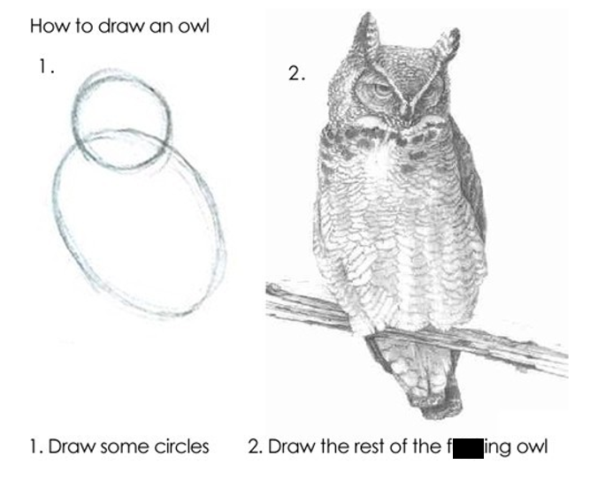

```{r setup, include=FALSE}
options(htmltools.dir.version = FALSE)

knitr::opts_chunk$set(echo = TRUE,
                      message = FALSE,
                      warning = FALSE,
                      cache = TRUE,
                      fig.width = 12)

library(tidyverse)
library(knitr)
library(here)
library(kableExtra)

```

## Housekeeping

* Homework 1 due today
* Groups due today
  - I need emails from everyone by 5pm (if you have not already emailed)
  
# Homework 1

# Data Visualization with {ggplot2} 

Week 3

## Agenda {.smaller}

`{ggplot2}`

* syntax
* continuous data visualizations
* categorical data visualizations
* options
  + color/fill
  + transparency
  + labels
  + facets

**Learning Objectives**

* Understand the basic syntax requirements for `{ggplot2}` 
* Recognize various options for displaying continuous and categorical data
* Familiarity with various `{ggplot2}` options
  + color/fill
  + transparency
  + labels
  + facets

# Share! 


## [`{datapasta}`](https://github.com/MilesMcBain/datapasta)

* Copy and paste data to and from `R`
* VERY handy!
* Good for [reprex](https://github.com/tidyverse/reprex) 
  + posting questions on [Posit Community](https://forum.posit.co/) or stackoverflow

[**demo**]{style="color:#D55E00;"}

## 

{width="70%"}

::: aside
Credit [Allison Horst](https://allisonhorst.com/data-science-art)
:::

## Providing grammar for: {.smaller}

* Graphics 
  + `{ggplot2}`
* Data manipulations 
  + `{dplyr}`
  + `{tidyr}`
* Expanding area of specialized topics
  + `{lubridate}`
  + `{glue}`
  + `{tidymodels}`
* Many more...

## Providing grammar for: {.smaller}

* Graphics 
  + <mark>`{ggplot2}`</mark>
* Data manipulations
  + `{dplyr}`
  + `{tidyr}`
* Expanding area of specialized topics
  + `{lubridate}`
  + `{glue}`
  + `{tidymodels}`
* Many more...

# {ggplot2}

## The `{ggplot2}` package

`gg` stands for the "grammar of graphics"

:::: {.columns}

::: {.column width="50%"}
{width="50%"}
:::

::: {.column width="50%"}

:::

::::

## Resources

The `{ggplot2}` package is one of the most popular `R` packages, and there are many resources to learn the syntax 

* ggplot2 book (email me for digital copy)
* Posit [cheat sheet](https://rstudio.github.io/cheatsheets/html/data-visualization.html?_gl=1*1j49xha*_ga*MTM2MTAwMDI2MS4xNjk2OTY0NDAy*_ga_2C0WZ1JHG0*MTY5Njk2NDQwMi4xLjAuMTY5Njk2NDQwMi4wLjAuMA..)
  + Can be helpful, perhaps more so after a little experience
* [R Graphics Cookbook](http://www.cookbook-r.com/Graphs/)
* [R Graph Gallery](https://www.r-graph-gallery.com/index.html)
  + past students have really liked this one

## Components {.smaller}

Every `ggplot` plot has three components

1. **data**
    + the `data` used to produce the plot
2. **aesthetic mappings (`aes`)**
    + between variables and visual properties 
3. **layer(s)**
    + usually through the `geom_*()` function to produce geometric shapes to be rendered

. . .

**`ggplot()` always takes a data frame (tibble) as the first argument**

## Basic syntax {.smaller}

[ggplot(]{style="color:#D55E00"}[data]{style="color:#0072B2"}, [aes(]{style="color:#009E73"}x = xvar, y = yvar[)]{style="color:#009E73"}[)]{style="color:#D55E00"} [+]{style="color:#CC79A7"} <br> [geom_function()]{style="color:#E69f00"}

. . .

[ggplot()]{style="color:#D55E00"} = the function is `ggplot` and the package is `{ggplot2}` 

. . .

[data]{style="color:#0072B2"} = the data to be plotted

. . .

[aes(]{style="color:#009E73"}x = xvar, y = yvar[)]{style="color:#009E73"} = the `aes`thetic mappings

. . .

[geom_function()]{style="color:#E69f00"} = the `geom`etrics of the plot; the "[function()]{style="color:#E69f00"}" here represents any of the `geom_*` offerings

. . .

::: {.fragment}
<mark>note the [+]{style="color:#CC79A7"} and <ins>NOT</ins> the `%>%`</mark>
:::

## `{ggplot2}` template

```{r}
#| eval: false

ggplot(data, aes(mappings)) +
  geom_function()

```

. . .

or equivalently

. . .

```{r}
#| eval: false

data %>% 
  ggplot(aes(mappings)) +
  geom_function()

```


## Some data for today {fig-align="right" width="10%"} 

[run the following]{style="color:#D55E00;"}

```{r}
#| echo: true

library(tidyverse)
library(palmerpenguins)

head(penguins)
```

# Continuous Data

## Setting up a plot

Run the following code. What do you see?

```{r pengemp}
#| output-location: slide

penguins %>% 
  ggplot(aes(bill_length_mm, body_mass_g)) 
```

## Setting up a plot

We have to add some layers!



## Setting up a plot

It's ready for you to add some `geom`etric <ins>layers</ins>...what should we add?

## How about points?

```{r}
#| output-location: fragment
#| code-line-numbers: "|3"

penguins %>% 
  ggplot(aes(bill_length_mm, body_mass_g)) +
  geom_point()
```

## Adding layers

* In the previous slide, we added a layer of points
* The `geom_point()` layer is a function, complete with it's own arguments

. . .

Let’s change the color of the points

How would you change the color of the points? 
	
<ins>or</ins> 

How would you find out about changing the color of the points?

. . .

`?geom_point`

## `color`

```{r peng-2}
#| output-location: fragment
#| code-line-numbers: "|3"

penguins %>% 
  ggplot(aes(bill_length_mm, body_mass_g)) +
  geom_point(color = "magenta")
```


## Add another layer

Let's add a smoothed line with `geom_smooth()`

```{r}
#| output-location: fragment
#| message: false
#| code-line-numbers: "|4"

penguins %>% 
  ggplot(aes(bill_length_mm, body_mass_g)) +
  geom_point(color = "magenta") + 
  geom_smooth()
```

## Add another layer

Let's add a smoothed line with `geom_smooth()`

```{r}
#| message: false
#| eval: false
#| code-line-numbers: "3"

penguins %>% 
  ggplot(aes(bill_length_mm, body_mass_g)) +
  geom_point(color = "magenta") + 
  geom_smooth()
```

*Note*: This is **NOT** the same as `geom_line()`. We are fitting a line of best fit with `geom_smooth()`

## You try

You probably got the [message]{style="color:#CC79A7;"} below when you ran (defaults)

```{r peng-4}
#| message: true

penguins %>% 
  ggplot(aes(bill_length_mm, body_mass_g)) +
  geom_point(color = "magenta") + 
  geom_smooth()
```

. . .

Change the `method` to `"lm"`

## Let's do this one together

Look at the help page – `?geom_smooth` 

1. Remove the `confidence` interval around the line

2. Now change the `*SE*` band to reflect a 68% confidence interval

## `color`: global vs. conditional 

Prior examples changed colors globally

- `geom_point(color = "magenta")`

. . .

Use `aes()` to access variables, and color according to a specific variable

. . .

- We use variable names within `aes()`

. . .

Let’s check the data again (`head()`) and the "species" variable (`table()`) 

. . .

[let's do this together]{style="color:#D55E00;"}

##

```{r peng-5}
#| message: false
#| output-location: fragment
#| code-line-numbers: "|3"

penguins %>% 
  ggplot(aes(bill_length_mm, body_mass_g)) +
  geom_point(aes(color = species)) 
```

## `color`: global vs. conditional 

```{r}
#| eval: false

penguins %>% 
  ggplot(aes(bill_length_mm, body_mass_g)) +
  geom_point(aes(color = species))
```

* When we did `geom_point(color = "magenta")` we put quotes around the color 
* Why now is "species" not in quotes?

. . .

* <ins>color names/hex codes are in quotes</ins> **NOT** in the `aes()`
* <ins>variable names are in the `aes()`</ins> **NOT** in quotes
* `aes()` is where you map to your data!

## Conditional flow through layers {.smaller}

If we use something like `color = “x”` in the first `aes`thetic, it will carry on through all additional layers

These two codes are the same:

```{r, eval=FALSE}
penguins %>% 
  ggplot(aes(bill_length_mm, body_mass_g)) +
  geom_point(aes(color = species))
```

```{r, eval=FALSE}
penguins %>% 
  gplot(aes(bill_length_mm, body_mass_g, color = species)) +
  geom_point()
```

. . .

But these two are not...why? [run to find out]{style="color:#D55E00;"}

```{r, eval=FALSE}
penguins %>% 
  ggplot(aes(bill_length_mm, body_mass_g)) +
  geom_point(aes(color = species)) + 
  geom_smooth()
```

```{r, eval=FALSE, out.height='50%'}
penguins %>% 
  ggplot(aes(bill_length_mm, body_mass_g, color = species)) +
  geom_point() + 
  geom_smooth()
```

## Be mindful with `aes()`

Using `aes()` when you **don't** need it

What is happening here?

```{r, fig.height=4}
penguins %>% 
  ggplot(aes(bill_length_mm, body_mass_g)) +
  geom_point(aes(color = "blue")) + 
  geom_smooth()
```

## Be mindful with `aes()`

**Not** using `aes()` when you need it

What is happening here?

```{r, fig.height=4, error=TRUE, message=TRUE}
penguins %>% 
  ggplot(aes(bill_length_mm, body_mass_g)) +
  geom_point(color = species) + 
  geom_smooth()
```

::: aside
Kind of helpful message here.
:::

# Themes

## Let's talk themes

* The default is `theme_gray()`
  + I don't like it
* But there are a lot of build-in alternative in `{ggplot2}`
  + `theme_minimal()` is my favorite
* Check out the [`{ggthemes}`](https://yutannihilation.github.io/allYourFigureAreBelongToUs/ggthemes/) package for a lot of alternatives
  + These days I often use the [`colorblind`](https://yutannihilation.github.io/allYourFigureAreBelongToUs/ggthemes/colorblind/) theme for discrete values in my plots
  + I also like the [`{MetBrewer}`](https://github.com/BlakeRMills/MetBrewer) package, inspired by art in the Met
* Check out the [`{ggthemeassist}`](https://github.com/calligross/ggthemeassist) add-in

# More themes

* The [`{hrbrthemes}`](https://github.com/hrbrmstr/hrbrthemes) are nice
* Consider [building your own theme!](https://bookdown.org/rdpeng/RProgDA/building-a-new-theme.html)
* Or Google around

. . .

* Set the theme globally
  + One of the first lines in your .qmd file (after you load packages) could be:
  
`theme_set(theme_minimal())`

## Get a little fancy

* You can use `geom_point()` for more than one layer
* You can also use a different data source on a layer
* Use these two properties to highlight points
  + How about penguins from Torgersen Island?

##

```{r}
penguins %>% 
  ggplot(aes(bill_length_mm, body_mass_g)) +
  geom_point(color = "black")
```

##

```{r}
#| code-line-numbers: "4"
penguins %>% 
  ggplot(aes(bill_length_mm, body_mass_g)) +
  geom_point(color = "black") + 
  geom_point(data = dplyr::filter(penguins, island == "Torgersen"), color = "magenta")
```

##

```{r}
#| code-line-numbers: "5"

penguins %>% 
  ggplot(aes(bill_length_mm, body_mass_g)) +
  geom_point(color = "black") + 
  geom_point(data = dplyr::filter(penguins, island == "Torgersen"), color = "magenta") + 
  geom_smooth(se = FALSE)
```

##

```{r}
#| code-line-numbers: "6"

penguins %>% 
  ggplot(aes(bill_length_mm, body_mass_g)) +
  geom_point(color = "black") + 
  geom_point(data = dplyr::filter(penguins, island == "Torgersen"), color = "magenta") + 
  geom_smooth(se = FALSE) + 
  theme_minimal()
```

## Another option

`{gghighlight}` varying flexibility

```{r}
#| code-line-numbers: "|4"

penguins %>% 
  ggplot(aes(bill_length_mm, body_mass_g)) +
  geom_point(color = "magenta") + 
  gghighlight::gghighlight(island == "Torgersen") + 
  theme_minimal()
```

## Line plots

When should you use line plots instead of smooths?

. . .

* *Usually when time is involved*

. . .


What are some good candidate data for line plots?

. . .

* *Oserved versus model-implied (estimated)*

## `geom_line()`

Classic time series example 

`economics` data from `{ggplot2}`

```{r}
economics
```

## Let's try it

How do you think we'd fit a line plot to these data, showing unemployment ("_unemploy_") over time?

. . .

```{r, fig.height=4, fig.width=8}
economics %>% 
  ggplot(aes(date, unemploy)) +
  geom_line()
```

## Layers

What happens when we layer geom_line and geom_point?

```{r, eval=FALSE}
economics %>% 
  ggplot(aes(date, unemploy)) +
  geom_line() +
  geom_point()
```

[try it!]{style="color:#D55E00;"}

. . .

Not the best instance of this

It would work better on a plot with fewer time points, but you get the idea

# Labels

`labs()`

## Axis Labels

```{r axes-1}
#| output-location: fragment
#| code-line-numbers: "|5|6"

economics %>% 
  ggplot(aes(date, unemploy)) +
  geom_line() +
  theme_minimal() +
  labs(x = "Date",
       y = "Unemployment")
```

## Title

```{r axes-2}
#| output-location: fragment
#| code-line-numbers: "|7"

economics %>% 
  ggplot(aes(date, unemploy)) +
  geom_line() +
  theme_minimal() +
  labs(x = "Date", 
       y = "Unemployment",
       title = "Unemployment Over Time") 
```

## Subtitle

```{r axes-3}
#| output-location: fragment
#| code-line-numbers: "|8"

economics %>% 
  ggplot(aes(date, unemploy)) +
  geom_line() +
  theme_minimal() +
  labs(x = "Date", 
       y = "Unemployment",
       title = "Unemployment Over Time",
       subtitle = "This is the subtitle")
```

## Caption

```{r axes-4}
#| output-location: fragment
#| code-line-numbers: "|9"

economics %>% 
  ggplot(aes(date, unemploy)) +
  geom_line() +
  theme_minimal() +
  labs(x = "Date", 
       y = "Unemployment",
       title = "Unemployment Over Time",
       subtitle = "This is the subtitle",
       caption = "Created by Joe Nese") 
```

## Tag

```{r axes-5}
#| output-location: fragment
#| code-line-numbers: "|10"

economics %>% 
  ggplot(aes(date, unemploy)) +
  geom_line() +
  theme_minimal() +
  labs(x = "Date", 
       y = "Unemployment",
       title = "Unemployment Over Time",
       subtitle = "This is the subtitle",
       caption = "Created by Joe Nese",
       tag = "(A)") 
```

## Legend (one way)

```{r axes-6}
#| output-location: fragment
#| code-line-numbers: "|2,7"

penguins %>% 
  ggplot(aes(bill_length_mm, body_mass_g, color = species)) + # 'color = '
  geom_point() +
  theme_minimal() +
  labs(x = "Bill Length (mm)",
       y = "Body Mass (g)",
       color = "Species!") # 'color = '
```

# Facets

## Faceting

* One of the most powerful features of `{ggplot2}`
* Produce *n* plots by a specific variable

* `facet_wrap()`
  + wrap a sequence of panels into two dimensions
  + based on variables(s)

## Faceting

```{r facet-1}
#| output-location: fragment
#| code-line-numbers: "|5"

penguins %>% 
  ggplot(aes(bill_length_mm, body_mass_g)) + 
  geom_point() +
  geom_smooth() +
  facet_wrap(~species)
```

## Careful about the `~`

```{r}
#| message: true
#| warning: true
#| error: true

penguins %>% 
  ggplot(aes(bill_length_mm, body_mass_g)) + 
  geom_point() +
  geom_smooth() +
  facet_wrap(species)
```

## Faceting 

two variables (like a matrix)

```{r}
#| message: false
#| warning: false
#| code-line-numbers: "|5"

penguins %>% 
  ggplot(aes(bill_length_mm, body_mass_g)) + 
  geom_point() +
  geom_smooth() +
  facet_wrap(species ~ year) 
```

## Alternative specification - `vars()`

```{r}
#| eval: false
#| code-line-numbers: "|5"

penguins %>% 
  ggplot(aes(bill_length_mm, body_mass_g)) + 
  geom_point() +
  geom_smooth() +
  facet_wrap(vars(species))
```

<br>

```{r}
#| eval: false
#| code-line-numbers: "|5"

penguins %>% 
  ggplot(aes(bill_length_mm, body_mass_g)) + 
  geom_point() +
  geom_smooth() +
  facet_wrap(vars(species, year))
```

# Heatmaps

> A heatmap is a literal way of visualizing a table of numbers, where you substitute the numbers with colored cells. <br> - Nathan Yau

* Useful for finding highs and lows  - and sometimes patterns
* They don't always work well

## Example with correlations

```{r}
corr <- cor(mtcars)

pc <- corr %>% 
  as.data.frame() %>% 
  mutate(row = rownames(.)) %>% 
  pivot_longer(
    cols = -row,
    names_to = "col",
    values_to = "cor"
  )

head(pc)
```

## Heatmap

```{r}
pc %>% 
  ggplot(aes(row, col, fill = cor)) +
  geom_tile()
```

## Viridis

```{r}
#| code-line-numbers: "|4"

pc %>% 
  ggplot(aes(row, col, fill = cor)) +
  geom_tile() +
  scale_fill_viridis_c() 
```

# Categorical Data

## Data

`{fivethirtyeight}` package

dataset is `college_grad_students`

```{r}
#| output-location: fragment

theme_set(theme_minimal(base_size = 16))

#install.packages("fivethirtyeight")
library(fivethirtyeight)
# View(college_grad_students)
grad <- college_grad_students # simpler reference
grad
```

## Histogram

Histogram of "grad_total"

```{r, fig.height=4, fig.width=8}
grad %>% 
  ggplot(aes(x = grad_total)) +
  geom_histogram()
```

## Transparency - `alpha`

Add some transparency – perhaps this looks nicer

```{r, fig.height=4, fig.width=8}
#| code-line-numbers: "3"

grad %>% 
  ggplot(aes(x = grad_total)) +
  geom_histogram(alpha = 0.7) 
```

## `color` vs. `fill`

**In general**

* `color` defines the color a geom is *outlined*
* `fill` defines the color a geom is *filled* 

## `color` vs. `fill`

For example:

* `geom_point()` default has only has a color and **NO** fill because they're just points
* Point shapes 21–24 include both a color and a fill

```{r, echo=FALSE}
#| echo: false

df_shapes <- data.frame(shape = 0:24)
ggplot(df_shapes, aes(0, 0, shape = shape)) +
  geom_point(aes(shape = shape), size = 5, fill = 'red') +
  scale_shape_identity() +
  theme_void() +
  facet_wrap(~shape)
  
```

## How would we change the color of this plot?

```{r, eval=FALSE}
grad %>% 
  ggplot(aes(x = grad_total)) +
  geom_histogram(alpha = 0.7)
```

## How would we change the color of this plot?

```{r, fig.height=4, fig.width=8}
grad %>% 
  ggplot(aes(x = grad_total)) +
  geom_histogram(alpha = 0.7, color = "magenta")
```

## How would we change the ~~color~~ fill of this plot?

```{r, fig.height=4, fig.width=8}
#| output-location: fragment

grad %>% 
  ggplot(aes(x = grad_total)) +
  geom_histogram(alpha = 0.7, fill = "magenta")
```

## Color by variable

What if we wanted different colors by a variable -- *species*

```{r,fig.height=4, fig.width=8}
penguins %>% 
  ggplot(aes(x = body_mass_g)) +
  geom_histogram(aes(fill = species), alpha = 0.7)
```

## Density plot

Alternative representation of distribution

* Think of it as a smoothed histogram (uses kernel smoothing)
* The depiction of the distribution is **NOT** determined by the number of the bins you use, as are histograms

## Density plot

`geom_density()`

```{r, fig.height=4, fig.width=8}
penguins %>% 
  ggplot(aes(x = body_mass_g)) +
  geom_density()
```

## Density plot

Now let’s fill by *species*

```{r, fig.height=4, fig.width=8}
penguins %>% 
  ggplot(aes(x = body_mass_g)) + 
  geom_density(aes(fill = species), alpha = 0.2)
```

## Possible alternative? `facet_wrap`

```{r, fig.height=6, fig.width=10}
penguins %>% 
  ggplot(aes(x = body_mass_g)) + 
  geom_density(alpha = 0.2) +
  facet_wrap(~species)
```

## Even better

density ridges `{ggridges}`

```{r, fig.height=4, fig.width=8}
library(ggridges)

penguins %>% 
  ggplot(aes(x = bill_length_mm, y = species)) + 
  geom_density_ridges()

```


## `fill` 

```{r}
#| code-line-numbers: "3"

penguins %>% 
  ggplot(aes(bill_length_mm , species)) +
  geom_density_ridges(aes(fill = factor(year)))
```

## Add transparency for clarity

```{r}
#| code-line-numbers: "3"

penguins %>% 
  ggplot(aes(bill_length_mm , species)) +
  geom_density_ridges(aes(fill = factor(year)), alpha = 0.5)
```

## Viridis

* easier to read by those with colorblindness 
* prints well in gray scale

```{r, fig.height=5}
#| code-line-numbers: "|4"

penguins %>% 
  ggplot(aes(bill_length_mm , species)) +
  geom_density_ridges(aes(fill = factor(year)), alpha = 0.5) +
  scale_fill_viridis_d()
```

## Same fill function, different "`option`"

```{r, fig.height=4, fig.width=8}
#| code-line-numbers: "|4"

penguins %>% 
  ggplot(aes(bill_length_mm , species)) +
  geom_density_ridges(aes(fill = factor(year)), alpha = 0.7) +
  scale_fill_viridis_d(option = "plasma")
```

## Candy rankings `{fivethirtyeight}`

```{r}
#| output-location: fragment

candy <- candy_rankings %>% 
  pivot_longer(
    cols = chocolate:pluribus,
    names_to = "type",
    values_to = "foo") %>% 
  filter(foo) %>% 
  select(-foo)

candy
```

## Boxplot

```{r}
candy %>% 
  ggplot(aes(type, sugarpercent)) +
  geom_boxplot() 
```

## Violin plots

```{r}
candy %>% 
  ggplot(aes(type, sugarpercent)) +
  geom_violin() 
```

## Bar Charts

```{r}
head(mpg)
```

## Bar/Col Charts {.smaller}

:::: {.columns}

::: {.column width="50%"}
**`geom_bar()`**

* expects *x* **OR** *y*
* counts rows
* if you want to count the number of cases at each *x* or *y* position 
* makes the height of the bar proportional to the number of cases in each group
* uses `stat_count()` by default

:::

::: {.column width="50%"}
**`geom_col()`**

* expects *x* **AND** *y*
* expects numbers in your data
* if you want the heights of the bars to represent values in the data
* leaves the data as is
<br>
<br>
* uses `stat_identity()` by default

:::
::::

## `geom_bar()`

*mpg* data

```{r, fig.height=5, fig.width=10}
mpg %>% 
  ggplot(aes(class)) + # one variable in the `aes()`
  geom_bar() # counts the rows per class
```

## *summarized_mpg* data


```{r}
summarized_mpg <- mpg %>% 
  group_by(class) %>% 
  count()

head(summarized_mpg)
```

## `geom_col()`

*summarized_mpg* data

```{r, fig.height=5, fig.width=10}
summarized_mpg %>% 
  ggplot(aes(class, n)) + # two variables in the `aes()`
  geom_col() # data has the rows per class in "n"
```

##

:::: {.columns}

::: {.column width="40%"}
`geom_bar()` default

```{r}
mpg %>% 
  ggplot(aes(class)) + 
  geom_bar()
```
::: 

::: {.column width="60%" .fragment}

`geom_bar(stat = "identity")` 

```{r}
summarized_mpg %>% 
  ggplot(aes(class, n)) + 
  geom_bar(stat = "identity")
```
:::

::::

##

:::: columns

::: {.column width="40%"}
`geom_bar()` default

```{r}
mpg %>% 
  ggplot(aes(class)) + 
  geom_bar()
```
:::

::: {.column width="60%" .fragment}
`geom_col()` default

```{r}
summarized_mpg %>% 
  ggplot(aes(class, n)) + 
  geom_col()
```
:::

::::

##

:::: columns

::: {.column width="40%"}
`geom_bar()` default

```{r}
mpg %>% 
  ggplot(aes(class)) + 
  geom_bar()
```
:::

::: {.column width="60%" .fragment}
`geom_bar()` uh-oh

```{r}
summarized_mpg %>% 
  ggplot(aes(class)) + 
  geom_bar()
```
:::

::::

## What happened?

Let's look at our data again

:::: columns

::: {.column width="50%"}
```{r}
summarized_mpg
```
:::

::: {.column width="50%" .fragment}
```{r}
summarized_mpg %>% 
  ggplot(aes(class)) + 
  geom_bar()
```
:::

::::

## More bar plot options {.smaller}

```{r}
#| output-location: fragment

eclsk <- haven::read_sav(here::here("data", "ecls-k_samp.sav")) %>% 
  rio::characterize() %>% 
  janitor::clean_names()

ecls_smry <- eclsk %>%
    group_by(k_type, ethnic) %>%
    summarize(t1r_mean = mean(t1rscale))

ecls_smry
```

## Stacked bar plot

Look for effects in "ethnicity" by "k_type" (full/half day K)

```{r, fig.height=4, fig.width=10}
ecls_smry %>% 
  ggplot(aes(ethnic, t1r_mean)) +
  geom_col(aes(fill = k_type))
```

## Grouped bar plot

```{r, fig.height=4, fig.width=10}
#| code-line-numbers: "|4"

ecls_smry %>% 
  ggplot(aes(ethnic, t1r_mean)) +
  geom_col(aes(fill = k_type),
               position = "dodge")
```

## Rotating Labels

I have to look [this](https://stackoverflow.com/questions/1330989/rotating-and-spacing-axis-labels-in-ggplot2) up *every* time

```{r, fig.height=6, fig.width=10}
#| code-line-numbers: "|5"

ecls_smry %>% 
  ggplot(aes(ethnic, t1r_mean)) +
  geom_col(aes(fill = k_type),
           position = "dodge") +
  theme(axis.text.x = element_text(angle = 90, hjust = 1))
```

## Flip the coordinates

`coord_flip()`

```{r, fig.height=4, fig.width=10}
#| code-line-numbers: "|5"

ecls_smry %>% 
  ggplot(aes(ethnic, t1r_mean)) +
  geom_col(aes(fill = k_type),
           position = "dodge") +
  coord_flip() 
```

## Alternatively

`facet_wrap()`

```{r, fig.height=4, fig.width=10}
ecls_smry %>% 
  ggplot(aes(k_type, t1r_mean)) +
  geom_col(alpha = 0.8) +
  facet_wrap(~ethnic)
```

## Sometimes some redundancy works well

```{r, fig.height=4, fig.width=10}
ecls_smry %>% 
  ggplot(aes(k_type, t1r_mean, fill = k_type)) +
  geom_col(alpha = 0.8) +
  facet_wrap(~ethnic)
```

## `geom_*()` Review {.smaller}

* `geom_point()`
* `geom_smooth()`
* `geom_line()`
* `geom_tile()`
* `geom_histogram()`
* `geom_density()`
* `ggridges::geom_density_ridges()`
* `geom_boxplot()`
* `geom_violin()`
* `geom_bar()`
* `geom_col()`

## Challenge {.smaller}

* Start a new `R` project
* Create a new script, save it as "practice-plots.R"
* Load the `{tidyverse}`
* Print the **msleep** dataset to see it's structure (it's from `{ggplot2}`)

For each of the following, produce a separate plot

1. Plot the relation between "sleep_total" and "brainwt" (with "brainwt" as the DV) - scatter plot
2. Overlay a smooth on the previous plot
3. Color the points by "vore", but fit a single smooth
4. Fit separate smooths by "vore", but with all points being gray
5. Omit the standard error of the smooths
6. Use `ylim()` as an additional layer to restrict the *y*-axis to range from 0 to 5

# Next time

## Before next class {.smaller}

* Reading
  + [R4DS(2e) 4](https://r4ds.hadley.nz/data-transform)
* Supplemental Learning
  + [Codecademy: Modifying Data Frames](https://www.codecademy.com/courses/learn-r/lessons/r-data-frames-modifying)
  + [Codecademy: Aggregates in R](https://www.codecademy.com/courses/learn-r/lessons/r-aggregates/exercises/column-statistics)
* Homework
  + **Homework 2**
  + **Homework 3**


