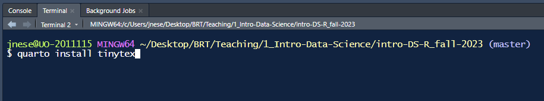
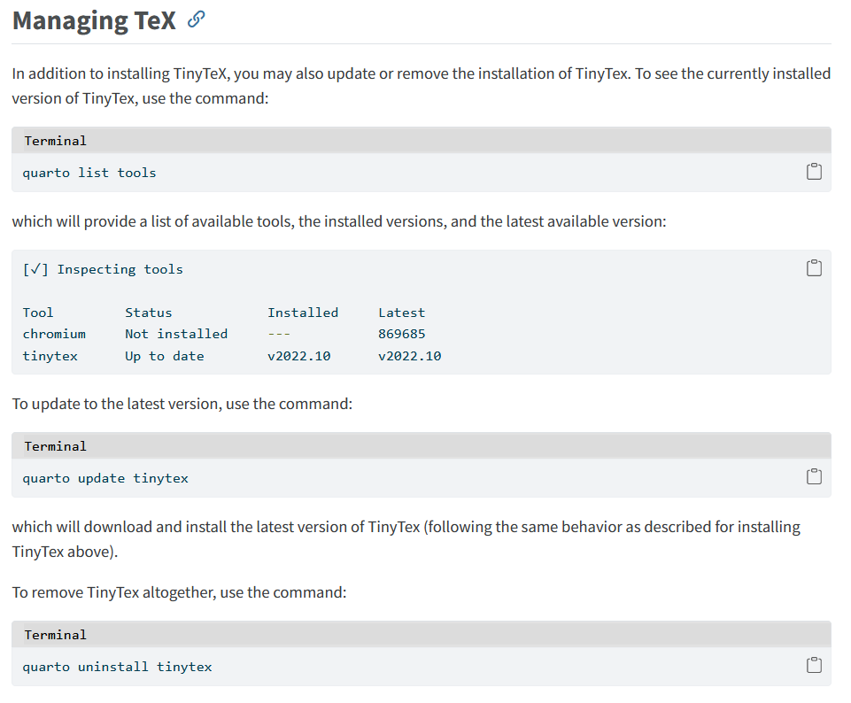
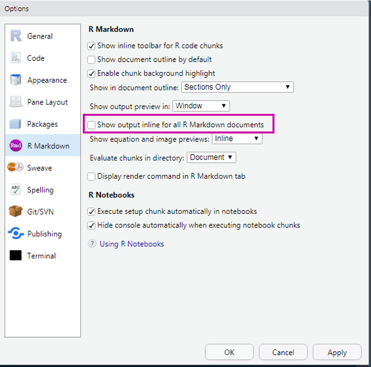
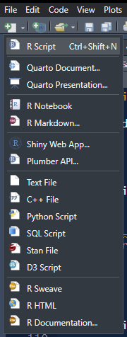
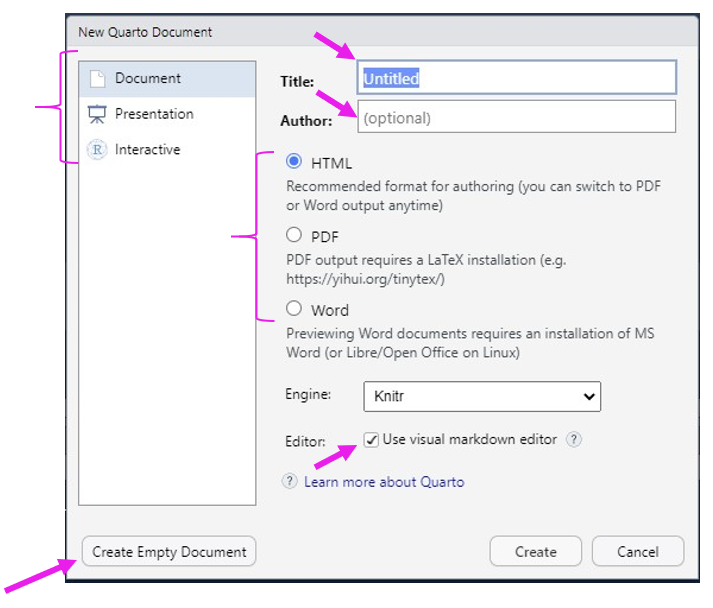
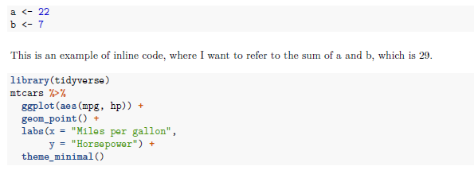
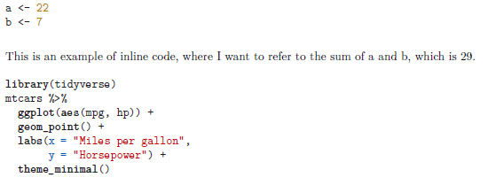

```{r}
#| label: setup
#| include: false

library(tidyverse)
library(knitr)
library(here)
library(kableExtra)
library(gt)
library(palmerpenguins)
library(DT)
library(reactable)
library(gtsummary)

```

# Share

Dodjivi

`%in%` & `if()`

# Quarto

Week 6

## Housekeeping

Final projects

## Agenda {.smaller}

* Quarto basics
* YAML options
* Chunk Options
* Inline Code

**Learning Objectives**

* Understand how to render Quarto documents and mix code with text
* Understand different chunk options
* Understand inline code evaluation

## What is Quarto? {.smaller}

- an open-source scientific and technical publishing system
- create dynamic content with Python, R, Julia, and Observable.
- publish reproducible, production quality articles, presentations, websites, blogs, and books in HTML, PDF, MS Word, ePub, etc.
- include equations, citations, crossrefs, figure panels, callouts, advanced layout, etc.
- a multi-language, next generation version of R Markdown (from Posit)
- includes many built in output formats (and options for customizing each)
- has native features for special project types like Websites, Books, and Blogs (rather than relying on external packages)
- everything

##


::: aside
Credit [Allison Horst](https://allisonhorst.com/data-science-art)
:::

## Formats

* Quarto will render to HTML and PDF really well 
* Word also supported
* You can also create presentations (slides), websites, books, etc.

## PDF Engines {.smaller}

- You need a tex (pronounced tek) distribution 
- Pandoc supports the use of a wide range of TeX distributions (pdflatex, xelatex, lualatex, tectonic, latexmk)
- I strongly recommend the use of [**TinyTeX**](https://yihui.org/tinytex/), which is a distribution of [TeX Live](https://tug.org/texlive/) that provides a reasonably sized initial download (~100 MB) that includes the 200 or so most commonly used TeX packages for Pandoc documents.

## PDF Engines

For this class, and probably everything you'll ever need: `TinyTex`

To install TinyTeX, use the following command in your **Terminal**:

`quarto install tinytex`

. . .



## [Managing TeX](https://quarto.org/docs/output-formats/pdf-engine.html#managing-tex)



## Note {.smaller}

Each year in April, TeXlive updates their remote package repository to the new year’s version of TeX. When this happens, previous year installations of TeX will not be able to download and install packages from the remote repository. When this happens, you may see an error like:

> Your TexLive version is not updated enough to connect to the remote repository and download packages. Please update your installation of TexLive or TinyTex.

When this happens, you can use `quarto update tinytex` to download and install an updated version of `tinytex`

## R Markdown aside



## Quarto

From within a RStudio Project, open a *Quarto Document*

:::: {.columns}

::: {.column width="50%"}


:::

::: {.column width="50%" .fragment}

:::

::::

## Quarto

From within a RStudio Project, open a *Quarto Document*

:::: {.columns}

::: {.column width="50%"}


:::

::: {.column width="50%" .fragment}

:::

::::

## Let's render!


## YAML Front Matter {.smaller}

```{r, eval=FALSE}
---
title: "World Changing Research"
format: html
---
```

* Yet Another Markup Language?
* Three dashes `---` before and after the YAML fields
    + Start with the default YAML
* Case sensitive
* Format sensitive (spaces & tab) - _very sensitive_
* *Many* other fields are possible
    + For example, you may want to include an argument for `format:` `pdf`, `html`, `docx`
    + Must be specified as it is rendered, if not supplied
* Full list [here](https://quarto.org/docs/reference/formats/html.html) (there's a lot)

## Authoring

```{r, eval=FALSE}
#| code-line-numbers: "|2|3|4|5|6|7|8|9"

---
title: "World Changing Research"
subtitle: "Seriously, it's really good research"
author: "Joe Nese"
date: "2023-5-25"
abstract: "Summary of document"
abstract-title: "Lable abstract"
doi: "digitil object identifier"
format: html
---
```

## Code Execution

Set the default behavior for all code chunks in the script with `execute`

```{r eval=FALSE}
#| code-line-numbers: "|5,6,7"

---
title: "World Changing Research"
author: "Joe Nese"
format: html
execute:
  eval: true
  echo: false
---
```

## `execute`

```{r, echo=FALSE}
yamlopts <- tibble::tribble(
                   ~Options,                        ~Arguments, ~Default,                                 ~Effect,
                   "`eval`",          "`true`, `false`, `[…]`", "`true`",                    "Evaluate the code?",
                   "`echo`", "`true`, `false`, `fence`, `[…]`", "`true`",                        "Show the code?",
                "`warning`",                         "logical", "`true`",                       "Print warnings?",
                "`message`",                         "logical", "`true`",                       "Print messages?",
                  "`error`",                         "logical", "`true`",         "Include errors in the output?",
                "`include`",                         "logical", "`true`", "Prevent any output (code or results)?",
                 "`output`",         "`true`, `false`, `asis`", "`true`",                 "Include code results?"
                ) 

fx_tbl_opts <- function(x){
  x |> 
    gt() |>
    fmt_markdown(columns = everything()) |> 
    tab_style(
      style = list(
        cell_fill(color = "white")
        ),
      locations = cells_body(
        rows = everything())
    )
}

yamlopts |> 
  fx_tbl_opts()

```

## `eval` {.smaller}

```{r, echo=FALSE}
yamlopts |>
  fx_tbl_opts() |> 
  tab_style(
    style = list(
      cell_fill(color = "#F0E442")
      ),
    locations = cells_body(
      rows = 1)
  )
```

* `eval`uates code
* if `false` it just echos the code into output

## `echo` {.smaller}

```{r, echo=FALSE}
yamlopts |>
  fx_tbl_opts() |> 
  tab_style(
    style = list(
      cell_fill(color = "#F0E442")
      ),
    locations = cells_body(
      rows = 2)
  )
```

* show (`echo`) source code in rendered output
* `echo: false` is most useful when producing a report for somebody who doesn't use `R` and has no use for, or knowledge of, the code

## `warning` {.smaller}

```{r, echo=FALSE}
yamlopts |>
  fx_tbl_opts() |> 
  tab_style(
    style = list(
      cell_fill(color = "#F0E442")
      ),
    locations = cells_body(
      rows = 3)
  )
```

## `message` {.smaller}

```{r, echo=FALSE}
yamlopts |>
  fx_tbl_opts() |> 
  tab_style(
    style = list(
      cell_fill(color = "#F0E442")
      ),
    locations = cells_body(
      rows = 4)
  )
```

* include `message`s in rendered output

## `error` {.smaller}

```{r, echo=FALSE}
yamlopts |>
  fx_tbl_opts() |> 
  tab_style(
    style = list(
      cell_fill(color = "#F0E442")
      ),
    locations = cells_body(
      rows = 5)
  )
```

* Include errors in the output 
* If `false`, then errors executing code will  halt processing of the document

## `include` {.smaller}

```{r, echo=FALSE}
yamlopts |>
  fx_tbl_opts() |> 
  tab_style(
    style = list(
      cell_fill(color = "#F0E442")
      ),
    locations = cells_body(
      rows = 6)
  )
```

* Code will execute, but neither code or results will show in the output

## `output` {.smaller}

```{r, echo=FALSE}
yamlopts |>
  fx_tbl_opts() |> 
  tab_style(
    style = list(
      cell_fill(color = "#F0E442")
      ),
    locations = cells_body(
      rows = 7)
  )
```

* Include the results of executing the code in the output. Possible values:
    + `true`: show results
    + `false`: do not show results
    + `asis`: output as raw markdown; use for rendering tables!
    
## figures

So many options for figures. 

One is to set figure width/height

```{r eval=FALSE}
#| code-line-numbers: "|7,8"

---
title: "World Changing Research"
format: html
execute:
  eval: true
  echo: false
fig-width: 6.5
fig-height: 8
---
```

## Syntax Highlighting {.smaller}

* The YAML will control a lot of how a document looks 
* For example, if you wanted to render with a different [syntax highlighter](https://bookdown.org/yihui/rmarkdown/html-document.html)

:::: {.columns}

::: {.column width="50%"}
standard
<br>
```{r, eval=FALSE, echo=TRUE}
---
title: "Doc Title"
format: pdf
---
```
<br>

:::

::: {.column width="50%" .fragment}
`tango`
<br>
```{r, eval=FALSE, echo=TRUE}
---
title: "Doc Title"
format: 
  pdf:
    highlight-style: tango
---
```
<br>


:::

::::

## Table of Contents

* Specify a table of contents in the YAML
* A table of contents will be automatically generated for you based on your **headers**

\# Header 1
<br>
\#\# Header 2

```{r, eval=FALSE}
#| code-line-numbers: "|4"

---
format: 
  html:
    toc: true
---
```

## [Headers](https://quarto.org/docs/authoring/markdown-basics.html#headings)

Great for organizing text **and** code

\# Level 1
<br>
\#\# Level 2
<br>
\#\#\# Level 3


## TOC - change depth

* By default, the TOC will only go down to 3 levels
* Change that with `toc-depth:`

```{r, eval=FALSE}
#| code-line-numbers: "|5"

---
format: 
  html:
    toc: true
    toc-depth: 5
---
```

## TOC - location {.smaller}

* For **HTML** format by default floats the table of contents to the right
* The floating TOC can be used to navigate to sections of the document and also will automatically highlight the appropriate section as the user scrolls 
* The table of contents is responsive and will become hidden once the viewport becomes too narrow
* You can alternatively position it at the `left` or in the `body`

```{r, eval=FALSE}
#| code-line-numbers: "|5"

---
format: 
  html:
    toc: true
    toc-location: left
---
```

## TOC - title

You can customize the title used for the table of contents using the `toc-title` option

```{r, eval=FALSE}
#| code-line-numbers: "|5"

---
format: 
  html:
    toc: true
    toc-title: Contents
---
```

## Code Folding

* Use the `code-fold` option to include code but have it hidden by default
* Use custom text for the code display button (the default is just "Code")


```{r, eval=FALSE}
#| code-line-numbers: "|4|5"

---
format:
  html:
    code-fold: true
    code-summary: "Show the code"
---
```

[Popcorn Experiment]{style='color:#D55E00'}

## Code Chunks vs. Text


## Code Chunks

Start a code chunk with ````{r} `

Then produce some `R` code

then close the chunk with three additional back ticks ```` `

<b> OR </b>

<b>Dropdown</b>: *Code* ⬇️ *Insert Chunk*

<b>Shortcut</b>: `Ctrl/Command + Alt + I`

```{r}
#| echo: fenced
a <- 22
b <- 7

a / b
```

## Chunk Names {.smaller}

* Use single word: `chunk1`
* Or use hyphen (`-`) to separate words: `chunk-1` 
* Do **not** use spaces: ~~`chunk 1`~~
* Do **not** use underscore ~~`chunk_1`~~
* Chunk names can only be used **once**

. . .

Think kebabs, not snakes

* `bar-plot-1`
* `bar-plot-2`
* `hist-plot-1`
* `model-1`

::: aside
[Allison Hill](https://apreshill.github.io/rmd4cdc/#100)
:::

## [Lists](https://quarto.org/docs/authoring/markdown-basics.html#lists)<sup>^</sup> {.smaller}

Note that lists require an entire blank line above the list, otherwise it will appear as normal text along a single line and **not** rendered in list form 

<sup>^</sup> not an `R` vector list

```{=html}
<iframe data-external="1" width="780" height="500" src="https://quarto.org/docs/authoring/markdown-basics.html#lists" ></iframe>
```

## More Advanced Options

* chunk options
* setting global options
* inline code evaluation

# Chunk Options

## Chunk Options

Chunk options are typically included in special comments at the top of code chunks

`#|` (think hash pipe?)

This is how you override the global options within a particular chunk

```{r}
#| echo: fenced
#| eval: false

# comment
a <- 22
a / 7
```

## Revisit

```{r, echo=FALSE}
yamlopts |> 
  fx_tbl_opts()
```

## Another Chunk Option

`label`
: chunk name (or label)

## `echo` and `eval`

:::: {.columns}

::: {.column width="50%"}

`echo: false`

don't show code <br>

Text here...
```{r}
#| echo: false

a <- 22
a / 7
```

more text here
:::

::: {.column width="50%" .fragment}

`eval: false`

don't evaluate code <br>

Text here...
```{r}
#| echo: fenced
#| eval: false
a <- 22
a / 7
```
<br>
more text here
:::

::::

## `warning: true`

Warning **is** printed to the console when rendering

```{r}
#| echo: fenced
#| warning: true
ggplot(msleep, aes(sleep_rem, sleep_total)) + 
  geom_point()
```

## `warning: false`

Warning is **not** printed to the console when rendering

```{r}
#| echo: fenced
#| warning: false
ggplot(msleep, aes(sleep_rem, sleep_total)) + 
  geom_point()
```

## `message: true`

```{r}
#| echo: fenced
#| message: true

ggplot(msleep, aes(sleep_total)) + 
  geom_histogram()
```

## `message: false`

```{r}
#| echo: fenced
#| message: false

ggplot(msleep, aes(sleep_total)) + 
  geom_histogram()
```


## `error: true`

This will show errors in the rendered document

```{r}
#| echo: fenced
#| error: true

ggplot(msleep, aes(sleep_rem, sleep_total)) + 
  geom_point())
```

## `error: false`

The document won't render if it encounters an error


## `include`

`include: false` 

don’t show code or results

Good use of this is for a code chunk where you load packages

# Inline Code

## Inline `R` Code {.smaller}

Inline code is code that runs in your prose (i.e., not code chunks)

Two back ticks that enclose the letter 'r' produce inline code to be evaluated \` `r knitr::inline_expr("code")` \`

This is **extremely** useful in writing reports. Never have to update any numbers in text, regardless of changes to your models or data (if you are careful about it).

. . .

```{r}
#| echo: fenced
a <- 22
b <- 7
```

**script:**

This is an example of inline code where I want to refer to the sum of a and b, which is \``r knitr::inline_expr("a + b")`\`

**output:**

This is an example of inline code where I want to refer to the sum of a and b, which is `r a + b`

## Example

[popcorm-experiment.qmd]{style='color:#D55E00'}

# Formatting Prose

## Inline Formatting {.smaller}

* *Italics*
    + single asterisk  \**italicized text*\*
    + single underscore \_ _italicized text_\_
* **Bold**
    + double asterisks \*\***bold**\*\*
    + double underscores \_\_ __bold__\_\_
* Inline code
    + execute code: back ticks + r `` `r knitr::inline_expr("code")` `` 
    + show code: back ticks **no** r \``code`\`
    
## Escaping

Sometimes you may not want the formatting to occur, and instead just show what you've typed

* For example, you want to type a hashtag, and not have it be a Header
<br>
Escape with `\`

\\# I escape the pound symbol with `\` 

\# I escaped the pound symbol to print this

## [Tabsets](https://quarto.org/docs/output-formats/html-basics.html#tabsets)

* Organize content by adding a div `::: {.panel-tabset}`
* create a new tab using top-level headings within the div
    + `## New tab`
* Close the div `:::`

* `.tabset-pills` will make the tabs appear as pills

## Tabset

```{r, eval=FALSE}
Research Results

::: {.panel-tabset}

## Grade 1
Grade 1 results here!

## Grade 2
Here are the Grade 2 figures and tables!

## Grade 3
Now you are seeing Grade 3 stuff!

:::

```

## 

Research Results

::: {.panel-tabset}

## Grade 1
Grade 1 results here!

## Grade 2
Here are the Grade 2 figures and tables!

## Grade 3
Now you are seeing Grade 3 stuff!

:::

# Quarto Visual Editor

## Visual Editing {.smaller}

Available as a feature of the RStudio IDE (eventually also be made available in standalone form)

The Quarto visual editor provides [WYSIWYM](https://en.wikipedia.org/wiki/WYSIWYM) editing 

* tables
* citations
* cross-references
* footnotes
* divs/spans
* definition lists
* attributes
* raw HTML/TeX
* more

## [Shortcuts](https://quarto.org/docs/visual-editor/options.html#shortcuts)

```{=html}
<iframe data-external="1" width="780" height="500" src="https://quarto.org/docs/visual-editor/#keyboard-shortcuts" ></iframe>
```

## Even better

Insert anything!

You can also use `/` to insert just about anything

Just execute the shortcut then type what you want to insert

[demo]{style='color:#D55E00'}

## Editor Toolbar {.smaller}

The editor toolbar includes buttons for the most commonly used formatting commands:


Additional commands are available on the `Format`, `Insert`, and `Table` menus

{width='20%'}

## Learn more {.smaller}

* [Technical Writing](https://quarto.org/docs/visual-editor/technical.html) covers features commonly used in scientific and technical writing, including citations, cross-references, footnotes, equations, embedded code, and LaTeX
* [Content Editing](https://quarto.org/docs/visual-editor/content.html) provides more depth on visual editor support for tables, lists, pandoc attributes, CSS styles, comments, symbols/emojis, etc
* [Shortcuts & Options](https://quarto.org/docs/visual-editor/options.html) documents the two types of shortcuts you can use with the editor: standard keyboard shortcuts and markdown shortcuts and describes various options for configuring the editor
* [Markdown Output](https://quarto.org/docs/visual-editor/markdown.html) describes how the visual editor parses and writes markdown and describes various ways you can customize this


# References

## References in .qmd

* supports bibliographies in a wide variety of formats 
* we will use BibTeX 

Add a bibliography to your document using the `bibliography` YAML metadata field

```{r}
#| eval: false
#| code-line-numbers: "3"
---
title: "My Document"
bibliography: references.bib
link-citations: true
---
```

::: aside
Note the `link-citations: true` option which will make your citations hyperlinks to the corresponding bibliography entries
:::

## References {.smaller}

To include references in your .qmd, you must:

* Create an external `.bib` file using LaTeX formatting
    + use RStudio to open new Text File
* Include `bibliography: name_of_your_bib_file.bib` in your YAML
    + *references.bib*
* Refer to the citations in text using `@`
* For parenthesis around the citation, used brackets - `[@BibTex_citekey]`

. . .

What is BibTex?

. . .

What is a BibTex *citekey*?

. . .

Why are you doing this to us, Joe, we just want to code

## BibTex

* BibTex is just a text-based file format for lists of bibliography items like articles, books, `R` packages, etc.
* BibTex is independent of any reference/citation style
    + (I happen to use APA, you may use something else)

## BibTex and *citekey*

This is what BibTex looks like

The "*citekey*" is the key you will use to reference the entry in your prose


## Inserting citations {.smaller}

Insert citations in your prose 

+ Insert -> Citation command, or
+ use markdown syntax directly
    - `[@cite]`
    - `@cite`

References are included automatically at the end of the document

* Citations go inside square brackets and are separated by semicolons
* Each citation must have a key, composed of `@` plus the citekey from your .bib file 
    + citekeys key must begin with a letter, digit, or `_`, 
    + may contain alphanumerics, `-`, and internal punctuation characters (`:.#$%&-+?<>~/`)

## Citation options

```{r echo=FALSE}
tibble::tribble(
  ~`Citation Style (using the tag)`,                                  ~Output,
                        "@Briggs11",                "Briggs and Weeks (2011)",
  "[see @Baldwin2014; @Caruso2000]", "(see Baldwin et al. 2014; Caruso 2000)",
                  "[@Linn02, p. 9]",             "(Linn and Haug 2002, p. 9)",
                  "[-@Goldhaber08]",                                  "(2008)"
  ) |> 
  gt() |> 
  tab_style(
    style = cell_text(weight = "bold"), 
    locations = cells_column_labels(columns=c(1, 2)))

```

## Remember... {.smaller}

Cite `R`!

```{r}
citation()
```

## Remember... {.smaller}

And the packages you used!

```{r}
citation("tidyverse")
```

## Citations in .qmd [demo]{style='color:#D55E00'} {.smaller}

1. Open a new qmd document
2. In your YAML, add a new line for `bibliography:` followed by the name of your bibliography file, which should be in the same directory, and should be the bare name (i.e., not quotes)
    + `bibliography: references.bib`
3. Open a text file in RStudio, save it with a `.bib` extension
    + name it `references.bib`
4. Go to Google Scholar and find a reference to cite. Copy and paste the citation into your `.bib` file using Google's cite option
5. Include a reference to the citation in your qmd file
6. Reference Section: references are included automatically at the end of the document (*note*: default is not APA format)
    + `html` - if you are rendering to html, you will automatically get a "*References*" heading
    + `pdf` - if you are rendering to PDF
      - include a page break in your prose so your *References* are on a separate page: `\newpage`
      - include `# References` as the last line of your document to give it a heading title
7. Render

## Citations in .Rmd [demo]{style='color:#D55E00'}

(1) Open a new qmd document

(2) In your YAML, add a new line for `bibliography:` followed by the name of your bibliography file, which should be in the same directory, and should be the bare name (i.e., not quotes)
  + `bibliography: references.bib`

```{r, eval=FALSE}
---
title: "Bibliography example"
author: "Joe Nese"
format: pdf
bibliography: references.bib
---
```

(3) Open a text file in RStudio, save it as `references.bib` 

## Citations in .Rmd [demo]{style='color:#D55E00'} {.smaller}

(4) Find references to cite
    + You can copy/paste the citation into your .bib file using Google's  "[Cite]{style='color:#56B4E9'}" option
    + You can (and should!) cite the `R` packages you use! `citation("package-name")` and `citation()` to cite `R`

(5) Include a reference to the citation in your .qmd file 

(6) Let's render to PDF
    + Include a page break so your citations are on a separate page (`\newpage`)
    + Add the `# References` heading as the last line of your document to give the section a title

(7) Render as PDF

## Other options

* [`{citr}`](https://github.com/crsh/citr)
  + a GUI interface
* [Zotero](https://blog.rstudio.com/2020/11/09/rstudio-1-4-preview-citations/#citations-from-zotero)
* [DOI](https://blog.rstudio.com/2020/11/09/rstudio-1-4-preview-citations/#citations-from-dois)

# Tables

Quick intro

## 


## This is not a table

```{r}
#| output-location: fragment

penguins |> 
  group_by(species) |> 
  summarize(across(c(bill_length_mm:bill_depth_mm), ~mean(., na.rm = TRUE)))
```


## Tables {.smaller}

**Many options**

* `knitr::kable()` for basic tables of any sort
    + try `booktabs = TRUE` argument for APA-like table format
    + Use `{kableExtra}` for extensions (example for [html](https://haozhu233.github.io/kableExtra/awesome_table_in_html.html) and [pdf](https://haozhu233.github.io/kableExtra/awesome_table_in_pdf.pdf))
* [`{gt}`](https://github.com/rstudio/gt)
    + tidy- and APA-friendly (with effort)
* [`{DT}`](https://rstudio.github.io/DT/)
    + great for displaying a lot of data in a manageable way
    + multiple pages, search and sort features, etc.
* [`{reactable}`](https://glin.github.io/reactable/)
    + great for displaying a lot of data in a manageable way
    + multiple pages, search and sort features, etc.
* [`{gtsummary}`](http://www.danieldsjoberg.com/gtsummary/)
    + **amazing** for summary tables

## Table chunk options

For many tables, you may have to specify 

`#| results: asis` 

or you can end up with wacky display (html code output)

```{r}
#| echo: fenced
#| eval: false
#| results: asis

penguins |> 
  group_by(species, year) |> 
  summarize(across(c(bill_length_mm:body_mass_g), ~mean(., na.rm = TRUE))) |> 
  gt()

```

## `kable()` {.smaller}


```{r}
#| output-location: fragment
#| code-line-numbers: "|4"


penguins |> 
  group_by(species, year) |> 
  summarize(across(c(bill_length_mm:body_mass_g), ~mean(., na.rm = TRUE))) |> 
  kable()
```

## `kable()` {.smaller}

```{r, results='asis'}
#| output-location: fragment
#| results: asis
#| code-line-numbers: "|4|5|6|7"

penguins |> 
  group_by(species, year) |> 
  summarize(across(c(bill_length_mm:body_mass_g), ~mean(., na.rm = TRUE))) |> 
  kable(caption = "kable() Table",
        col.names = c("Species", "Year", "Bill Length", "Bill Depth", "Flipper Length", "Body Mass"),
        digits = 1,
        booktabs = TRUE)
```

## `kable()` and `{kableExtra}` {.smaller}

```{r}
#| output-location: fragment
#| results: asis
#| code-line-numbers: "|5|8|9"

penguins |> 
  group_by(species, year) |> 
  summarize(across(c(bill_length_mm:body_mass_g), ~mean(., na.rm = TRUE))) |> 
  kable(caption = "kable() Table", 
        col.names = c("Species", "Year", "Length (mm)", "Depth (mm)", "Length (mm)", "Body Mass (g)"),
        digits = 1, 
        booktabs = TRUE) |> 
  kableExtra::row_spec(0:9, background = "white") |> 
  add_header_above(c(" " = 2, "Bill" = 2, "Flipper" = 1, " " = 1)) 
```

## `kable()` and `{kableExtra}` {.smaller}

```{r}
#| output-location: fragment
#| results: asis
#| code-line-numbers: "|4|5|12,13,14"

penguins |> 
  group_by(species, year) |> 
  summarize(across(c(bill_length_mm:body_mass_g), ~mean(., na.rm = TRUE))) |> 
  ungroup() |> 
  select(-species) |> 
  kable(caption = "kable() Table", 
        col.names = c("Year", "Length (mm)", "Depth (mm)", "Length (mm)", "Body Mass (g)"), 
        digits = 1, 
        booktabs = TRUE) |> 
  kableExtra::row_spec(0:9, background = "white") |> 
  add_header_above(c(" " = 1, "Bill" = 2, "Flipper" = 1, " " = 1)) |> 
  pack_rows("Adelie", 1, 3) |> 
  pack_rows("Chinstrap", 4, 6) |> 
  pack_rows("Gentoo", 7, 9)
```

## `gt::gt()` {.smaller}

```{r}
#| output-location: fragment
#| results: asis
#| code-line-numbers: "|4"

penguins |> 
  group_by(species, year) |> 
  summarize(across(c(bill_length_mm:body_mass_g), ~mean(., na.rm = TRUE))) |> 
  gt()
```

## `gt::gt()` {.smaller}

```{r}
#| output-location: fragment
#| results: asis
#| code-line-numbers: "|5,6,7"

penguins |> 
  group_by(species, year) |> 
  summarize(across(c(bill_length_mm:body_mass_g), ~mean(., na.rm = TRUE))) |> 
  gt() |>
  fmt_number( 
    columns = 3:6, 
    decimals = 1 
  ) |> 
  tab_header(
    title = md("`{gt}` Table"))
```

## `gt::gt()` {.smaller}

```{r}
#| output-location: fragment
#| results: asis
#| code-line-numbers: "|9,10"

penguins |> 
  group_by(species, year) |> 
  summarize(across(c(bill_length_mm:body_mass_g), ~mean(., na.rm = TRUE))) |> 
  gt() |>
  fmt_number( 
    columns = 3:6, 
    decimals = 1 
  ) |> 
  tab_header( 
    title = md("`{gt}` Table")) 
```

## `gt::gt()` {.smaller}

```{r}
#| output-location: fragment
#| results: asis
#| code-line-numbers: "|12,13,14,15,16,17"

penguins |> 
  group_by(species, year) |> 
  summarize(across(c(bill_length_mm:body_mass_g), ~mean(., na.rm = TRUE))) |> 
  gt() |>
  fmt_number( 
    columns = 3:6, 
    decimals = 1 
  ) |> 
  tab_header(
    title = md("`{gt}` Table")
  ) |> 
  cols_label(
    year = "", 
    bill_length_mm = "Bill Length", 
    bill_depth_mm = "Bill Depth", 
    flipper_length_mm = "Flipper Length", 
    body_mass_g = "Body Mass") 
```

## `gt::gt()` {.smaller}

```{r, results='asis'}
#| output-location: fragment
#| results: asis
#| code-line-numbers: "18,19,20,21,22,23,24"

penguins |>
  group_by(species, year) |> 
  summarize(across(c(bill_length_mm:body_mass_g), ~mean(., na.rm = TRUE))) |> 
  gt() |>
  fmt_number( 
    columns = 3:6, 
    decimals = 1 
  ) |> 
  tab_header(
    title = md("`{gt}` Table")
  ) |> 
  cols_label( 
    year = "", 
    bill_length_mm = "Bill Length", 
    bill_depth_mm = "Bill Depth", 
    flipper_length_mm = "Flipper Length", 
    body_mass_g = "Body Mass") |> 
  tab_style( 
    style = list( 
      cell_fill(color = "magenta"), 
      cell_text(color = "white") 
      ), 
    locations = cells_body( 
      rows = c(1, 4, 7))) 
```

## `DT::datatable()` {.smaller}

```{r}
#| output-location: fragment
#| results: asis
#| code-line-numbers: "|2"

penguins |> 
  DT::datatable()
```

## `reactable::reactable()` {.smaller}

```{r}
#| output-location: fragment
#| results: asis
#| code-line-numbers: "|2"

penguins |> 
  reactable::reactable()
```

## `reactable::reactable()` {.smaller}

```{r}
#| output-location: fragment
#| results: asis
#| code-line-numbers: "|2"

penguins |> 
  reactable::reactable(filterable = TRUE, searchable = TRUE) 
```

## `{gtsummary}` {.smaller}

```{r}
#| output-location: fragment
#| results: asis
#| code-line-numbers: "|2"

penguins |> 
  gtsummary::tbl_summary()
```

## `{gtsummary}` {.smaller}

```{r}
#| output-location: fragment

m <- lm(body_mass_g ~ 1 + bill_length_mm + flipper_length_mm,
        data = penguins)

m |> 
  gtsummary::tbl_regression()
```

##


# Next time

## Before next class

* Homework
    + Homework 6 (let's take a look)
    + Homework 7 (let's take a look)
* Reading
    + [R4DS(2e) 13](https://r4ds.had.co.nz/relational-data.html)
* Supplemental Learning
    + [Codecademy: Joining Tables in R](https://www.codecademy.com/courses/learn-r/lessons/r-multiple-tables/exercises/introduction)

