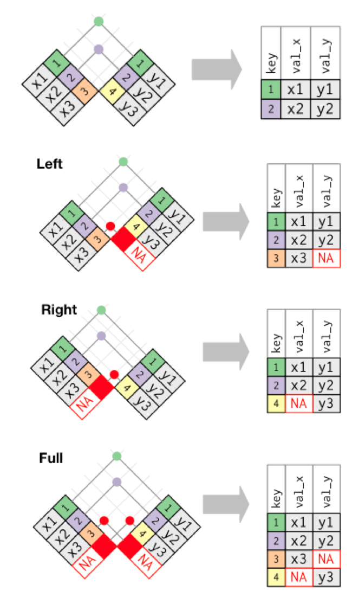
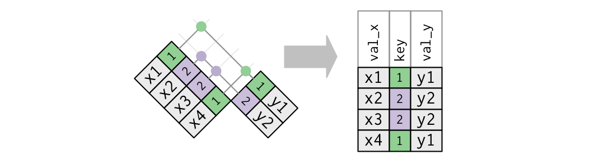

```{r include=FALSE}

library(tidyverse)
library(knitr)
library(kableExtra)
library(nycflights13)
library(gt)
library(here)

theme_set(theme_minimal(24))

```

# Homework Review

Homework 6

Homework 7

## [Celebrate yourself!]{style='color:#FFFFFF'} {background-image="https://media4.giphy.com/media/y3FzofnwM97ngxeO3o/giphy.gif?cid=ecf05e47v3d6hztnq52lqaoop57dz9eetu5kfr4xckfhp37j&ep=v1_gifs_search&rid=giphy.gif&ct=g"}

# Mutating Joins

Week 7

## Agenda {.smaller}

* `bind_rows()`
* `*_join()`

**Overall Purpose**

* Understand and be able to identify keys
* Understand different types of mutating joins
    + `left_join()`
    + `right_join()`
    + one-to-one
    + one-to-many
* Understand some ways joins fail

## A bit about joins

* Also data "merge"
* Today we'll talk about  **mutating joins**
* Mutating joins add columns to a dataset
* Mutating joins are the most common, but **filtering joins** can be very powerful

. . .

**What if I want to add rows?**

* Not technically a join (no key involved)
* Let's take a look

## Binding rows

```{r g34-datsets}

g3 <- tibble(sid = 1:3, 
             grade = rep(3, 3), 
             score = as.integer(rnorm(3, 200, 10)))
g4 <- tibble(sid = 9:11, 
             grade = rep(4, 3), 
             score = as.integer(rnorm(3, 200, 10)))
```

##

::: {.columns}

::: {.column width="50%"}

```{r g3-print}
g3
```

:::


::: {.column width="50%"}

```{r g4-print}
g4
```

:::

::::

## `bind_rows()`

* In examples like the previous data sets, we just want to combine the data by **stacking the rows**
* Data have same (or approximately same) columns
* We can do so with `bind_rows()`

```{r bind_rows1}
# output-location: fragment
bind_rows(g3, g4)
```

## `dplyr::bind_rows()`

* an efficient way to bind many data frames into one, by stacking rows
    + can bind multiple datasets

```{r, eval=FALSE}
one <- mtcars[1:4, ]
two <- mtcars[6:10, ]
three <- mtcars[12:14, ]

bind_rows(one, two, three)
```
  
* like joining (merging) data frames that have the same columns
* columns don't need to match when row-binding

## Optional `.id` argument

* What if we knew the grade, but didn't have a variable in each dataset already?
* Use `.id` to add an index for each dataset

```{r bind_rows2}
#| output-location: fragment
bind_rows(select(g3, -grade), select(g4, -grade), .id = "dataset")
```

## Recode `.id` column

```{r bind_rows_id_mutate}
#| output-location: fragment

bind_rows(select(g3, -grade), select(g4, -grade), .id = "dataset") |>
  mutate(grade = ifelse(dataset == 1, 3, 4))
```

## Even better 

```{r bind_rows3}
#| output-location: fragment

bind_rows(select(g3, -grade), select(g4, -grade), .id = "grade") |> 
  mutate(grade = ifelse(grade == 1, 3, 4))
```

## What if columns don't match exactly?

Pads with `NA`

```{r bind_rows4}
#| output-location: fragment

bind_rows(g3, g4[ ,-3], .id = "dataset")
```

## You can also `bind_cols()` {.smaller}

```{r}
read <- tibble(sid = c("a", "b", "c"), 
             read = as.integer(rnorm(3, 200,10)))
math <- tibble(math = as.integer(rnorm(3, 200,10)))
```

## 

:::: {.columns}

::: {.column width="50%"}

```{r}
read
```

:::

::: {.column width="50%"}

```{r}
math
```

:::

::::

## `bind_cols()`

```{r}
#| output-location: fragment
bind_cols(read, math)
```

. . .

But this is dangerous practice!

What if the rows are out of order?

# Joins

(not to be confused with row binding)

## Keys {.smaller}

* Uniquely identify rows in a dataset

. . .

* Variable(s) in common between two datasets to be joined
    + A key can be more than one variable

. . .

**Types of keys**

* Small distinction that you probably won't have to worry about much, but is
worth mentioning:
    + **Primary keys**: uniquely identify observations in *their* dataset
    + **Foreign keys**: uniquely identify observations in *other* datasets


## What's the primary key here? 

First, let's break down the code:

```{r load_ecls-k}
library(rio)
library(here)
library(tidyverse)
ecls <- import(here("data", "ecls-k_samp.sav")) |> 
  as_tibble() |> 
  characterize()
```

. . .

```{r, echo=FALSE}
ecls
```

## Let's verify the key

```{r double_check_ecls}
ecls |> 
  count(child_id)
```

## Let's verify the key

```{r}
#| output-location: fragment
ecls |> 
  count(child_id) |>
  arrange(desc(n)) |> 
  slice(1:3)
```

. . .

**[EVEN BETTER]{style='color:#F0E442'}**

```{r }
#| output-location: fragment
ecls |> 
  count(child_id) |>
  filter(n > 1)
```

## What about the key here? {.smaller}

```{r primary_key_income_ineq}
income_ineq <- read_csv(here("data", "incomeInequality_tidy.csv"))

head(income_ineq, n = 15)
```

##

```{r double_check_income_ineq}
#| code-line-numbers: "|2"
income_ineq |> 
    count(Year, percentile) |> 
    filter(n > 1)
```

## Sometimes there is no key {.smaller}

These tables have an **implicit** key - the row numbers

```{r eval = FALSE}
install.packages("nycflights13")
library(nycflights13)
```

```{r flights}
head(flights)
```

## 

```{r no_key}
#| code-line-numbers: "|2"
flights |> 
  count(year, month, day, flight, tailnum) |> 
  filter(n > 1)
```

## Create a key {.smaller}

If there is no key, it's often helpful to add one

These are called *surrogate* keys

```{r add_key}
#| code-line-numbers: "|2|"
flights2 <- flights |> 
  rowid_to_column()

flights2 |> 
  select(1:3, ncol(flights))
```

# Mutating joins

## Mutating `*_joins()`

* In `{tidyverse}`, we use `mutate()` to create new variables within a dataset

. . .

* A mutating join works similarly, in that we're adding new variables to the existing dataset through a join

. . .

* **Join**: Two tables of data merged by a common key

## Four types of joins

`left_join`
: keep all the data in the `left` dataset, drop any non-matching cases from the right dataset

. . .

`right_join`
: keep all the data in the `right` dataset, drop any non-matching cases from the left dataset

. . .

`inner_join`
: keep **only** data that matches in <b>both</b> datasets

. . .

`full_join`
: keep **all** the data in <b>both</b> datasets (also sometimes referred to as an *outer* join)

## Four types of joins



## Four types of joins

**Mutating joins**

`left_join`
: keep all the data in the `left` dataset, drop any non-matching cases from the right dataset

`right_join`
: keep all the data in the `right` dataset, drop any non-matching cases from the left dataset

. . .

**Filtering joins**

`inner_join`
: keep **only** data that matches in <b>both</b> datasets

`full_join`
: keep **all** the data in <b>both</b> datasets (also sometimes referred to as an *outer* join)

## We're going to focus on

**Mutating joins**

`left_join`
: keep all the data in the **left** dataset, drop any non-matching cases from the right dataset

`right_join`
: keep all the data in the **right** dataset, drop any non-matching cases from the left dataset

## Using joins to recode

Say you have a dataset like this

```{r eth-code-tbl}
#| code-line-numbers: "|1|2,3|4|5|6|7"
#| output-location: fragment
set.seed(1)
disab_codes <- c("00", "10", "20", "40", "43", "50", "60", 
                 "70", "74", "80", "82", "90", "96", "98")
dis_tbl <- tibble(
  sid = 1:200,
  dis_code = sample(disab_codes, 200, replace = TRUE),
  score = as.integer(rnorm(200, 200, 10))
  )
dis_tbl
```

## Codes {.smaller}

And you want to merge it with data like this

```{r, echo=FALSE}
tibble::tribble(
  ~Code,                        ~Disability,
     0L,                 "'Not Applicable'",
    10L,        "'Intellectual Disability'",
    20L,             "'Hearing Impairment'",
    40L,              "'Visual Impairment'",
    43L,                 "'Deaf-Blindness'",
    50L,         "'Communication Disorder'",
    60L,          "'Emotional Disturbance'",
    70L,          "'Orthopedic Impairment'",
    74L,         "'Traumatic Brain Injury'",
    80L,       "'Other Health Impairments'",
    82L,       "'Autism Spectrum Disorder'",
    90L,   "'Specific Learning Disability'",
    96L,      "'Developmental Delay 0-2yr'",
    98L,      "'Developmental Delay 3-4yr'"
  ) |> 
  kable() |> 
  kableExtra::kable_styling(font_size = 20)

```

## Recode method

Using `case_when()`

```{r}
#| eval: false

dis_tbl |> 
  mutate(disability = case_when(
    dis_code == "10" ~ "Intellectual Disability",
    dis_code == "20" ~ 'Hearing Impairment',
    ...,
    .default = "Not Applicable"
    )
  )
```

## Join method

```{r cod-tbl}
#| output-location: slide
#| echo: false

(dis_code_tbl <- tibble(
  dis_code = c(
    "00", "10", "20", "40", "43", "50", "60",
    "70", "74", "80", "82", "90", "96", "98"
    ),
  disability = c(
    'Not Applicable', 'Intellectual Disability',
    'Hearing Impairment', 'Visual Impairment',
    'Deaf-Blindness', 'Communication Disorder',
    'Emotional Disturbance', 'Orthopedic Impairment',
    'Traumatic Brain Injury', 'Other Health Impairments', 
    'Autism Spectrum Disorder', 'Specific Learning Disability', 
    'Developmental Delay 0-2yr', 'Developmental Delay 3-4yr'
    )
  ))
```

## Join the tables

```{r join-disab}
#| output-location: fragment
#| message: true
left_join(dis_tbl, dis_code_tbl)
```

# Imperfect key match?

## Consider the following {.smaller}

```{r join_data}
frl <- tibble(key = 1:3, frl = rbinom(3, 1, .5))

sped <- tibble(key = c(1, 2, 4), sped = rbinom(3, 1, .5))
```

. . .

```{r}
#| output-location: fragment
frl
```

. . .

```{r}
#| output-location: fragment
sped
```

## Consider the following

:::: {.columns}

::: {.column width="50%" .fragment}

`left_join()`?

```{r}
#| output-location: fragment
left_join(frl, sped)
```

`right_join()`?

```{r}
#| output-location: fragment
right_join(frl, sped)
```

:::

::: {.column width="50%" .fragment}

`inner_join()`?

```{r}
#| output-location: fragment
inner_join(frl, sped)
```

`full_join()`?

```{r}
#| output-location: fragment
full_join(frl, sped)
```

:::

::::

## 

::: aside
[From R4DS](https://r4ds.had.co.nz)]
:::

## Animations

All of the following animations were created by Garrick Aden-Buie and can be found [here](https://github.com/gadenbuie/tidyexplain)


##
    


##


## What if the key is not unique?

* Not an issue, as long as they are unique in **one** of the tables
    + In this case, it's called a **one-to-many** join
    + We saw this when we joined disability code with disability




##


## Example

:::: {.columns}

::: {.colum width = "50%"}

Student-level data

```{r stu_lev}
(stu <- tibble(
  sid = 1:9,
  scid = c(1, 1, 1, 1, 2, 2, 3, 3, 3),
  score = c(10, 12, 15, 8,  9, 11, 12, 15, 17)))
```

:::

::: {.colum width = "50%" .fragment}

School-level data

```{r }
(schl <- tibble(
  scid = 1:3,
  stu_tch_ratio = c(22.05, 31.14, 24.87),
  per_pupil_spending = c(15741.08, 11732.24, 13027.88)
  )
)
```

:::

::::

## One to many
```{r one_to_many_merge}
left_join(stu, schl)
```

## What if key is not unique to either table?

Generally this is an error

Result is probably not going to be what you want

## Example

```{r demos}
#| output-location: fragment
seasonal_means <- tibble(
  scid = rep(1:3, each = 3),
  season = rep(c("fall", "winter", "spring"), 3),
  mean = rnorm(3*3)
)
seasonal_means
```

##

```{r dup_merge}
left_join(stu, seasonal_means) 
```

## How do we fix this?

. . .


. . .

In some cases, the solution is obvious, in others it is not

But **you must have at least one unique key** to join the datasets

## In this case

Move the dataset to wide before joining

. . .

```{r }
#| output-location: fragment
seasonal_means_wide <- seasonal_means |> 
  pivot_wider(names_from = "season",
              values_from = "mean")
seasonal_means_wide
```

::: aside
We will cover this next week
:::

## Join

One to many join

```{r }
left_join(stu, seasonal_means_wide)
```

## Default join behavior {.smaller}

By default, the `_join` functions will use all columns with common names as keys

. . .

```{r flights2}
#| output-location: fragment

flights2 <- flights |> 
  select(year:day, hour, origin, dest, tailnum, carrier)

flights2[1:2, ]
```

. . .

```{r weather, highlight.output = c(2)}
#| output-location: fragment

weather[1:2, ]
```

## 

```{r join_flights_weather, message = TRUE}
left_join(flights2, weather)
```

## Use only certain keys?

If we were joining *flights2* and *planes*, we would not want to use the `year` variable in the join, because **it means different things in each dataset**

. . .

```{r planes}
head(planes)
```

## Specify `*_join()` keys {.smaller}

Specify the key variables with `join_by()` (a function for the `by = ` argument)

```{r join_flights2_planes}
#| output-location: fragment
left_join(flights2, planes)
```

. . .

```{r}
#| output-location: fragment
left_join(flights2, planes, join_by(tailnum))
```


```{r}
#| output-location: fragment
left_join(flights2, planes, join_by(tailnum), suffix = c("_flights", "_planes"))
```

## Specify `*_join()` keys

I like to **always** specify the `join_by()` variables

Makes intent explicit

Helps me review my own code

## Mismatched key names

```{r}
#| output-location: fragment

names(schl)[1] <- "school_id"
schl
```

. . .

```{r}
#| output-location: fragment
stu
```


## Join with mismatched key names

```{r join_name_mismatch}
#| error: true
#| output-location: fragment

left_join(stu, schl)
```

. . .

```{r}
#| output-location: fragment
left_join(stu, schl, join_by(scid == school_id))
```

## `join_by()`

You can read it out loud as "where x is equal to y", just like in other logical statements where `==` is pronounced as "is equal to"

# Next time

## Before next class

* Homework
    + **Homework 8**
* Supplemental Learning
    + [Codecademy: Data Cleaning in R](https://www.codecademy.com/courses/learn-r/lessons/r-data-cleaning)
* Reading
    + [R4DS(2e) 12](https://r4ds.had.co.nz/tidy-data.html)
    + [Wickham (2014)](http://www.jstatsoft.org/v59/i10/paper)
    + [R-Ladies Sydney. CleanItUp 5](https://rladiessydney.org/courses/ryouwithme/02-cleanitup-5/)

# Homework 8

# Final Project

## Final Project

Final paper: Quarto document

* Be fully reproducible
    + This implies the data are open
* Be a collaborative project hosted on GitHub
* Move data from its raw "messy" format to a tidy data format
* Include at least two exploratory plots
* Include at least summary statistics of the data in tables, although fitted models are also encouraged

## Final Project - Dates

* **Week 9  (11/26)**: Data prep script due

* **Week 10  (12/3)**:  Peer review due

* **Week 10 (12/3)**:  Final project presentations

* **Week 11 (12/10)**: Final Paper due

## Final Project - Data Prep Script

* Expected to be a work in progress
* Provided to your peers so they can learn from you as much as you can learn from their feedback

**Peer Review**

* Understand the purpose of the exercise
* Conducted as a professional product
* Should be **very** encouraging 
* Zero tolerance policy for inappropriate comments

## Final Project – Presentation

Groups are expected to present for approximately 15 minutes (split evenly among members). Group order randomly assigned. 

Presentation cover the following:

* Share your journey (everyone, at least for a minute or two)
* Discuss challenges you had along the way
* Celebrate your successes
* Discuss challenges you are still facing
* Discuss substantive findings
* Show off your cool figures!
* Discuss next `R` hurdle you want to address

## Final Project – Presentation Scoring Rubric

```{r, echo=FALSE}

read_csv(here("rubrics", "final-presentation_rubric.csv")) |> 
  mutate(across(everything(), ~ifelse(is.na(.), "", .))) |> 
  kable(caption = "<b>Final Presentation Rubric</b>") |> 
  kable_classic(full_width = F) |>
  row_spec(6, bold = TRUE) |> 
  kable_styling(font_size = 14, position = "left")
```

## Final Project – Paper

* Quarto document
    + Abstract, Intro, Methods, Results, Discussion, References
    + Should be brief: 3,500 words max 
* No code displayed - should look similar to a manuscript being submitted for publication
* Include at least 1 table
* Include at least 2 plots
* Should be fully open, reproducible, and housed on GitHub
    + I should be able to clone your repository, open the R Studio Project, and reproduce the full manuscript (by knitting the Quarto doc)

## Final Paper - Scoring Rubric

```{r, echo=FALSE, fig.height=4}

read_csv(here("rubrics", "final-project_rubric.csv")) |> 
  mutate(`Points Possible` = ifelse(is.na(`Points Possible`), "", `Points Possible`)) |>
  gt() |> 
  fmt_markdown(columns = everything()) |>
  tab_style(
    style = list(
      cell_text(weight = "bold")
      ),
    locations = cells_body(
      columns = everything(),
      rows = c(1, 8, 12, 20)
    )
  ) |>
  tab_style(
    style = list(
      cell_fill(color = "white")),
    locations = cells_body(
      columns = c(1, 2))
  ) |> 
  tab_options(column_labels.background.color = "#0072B2",
              table.font.size = px(10),
              container.height = pct(80))
```

## Final Project

The following functions: 

* `pivot_longer()`
* `mutate()`
* `select()`
* `filter()`
* `pivot_wider()`
* `group_by()`
* `summarize()`

