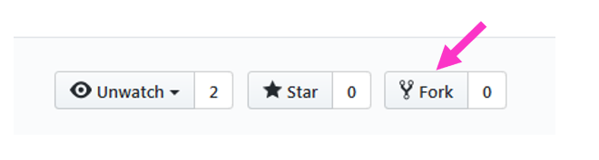
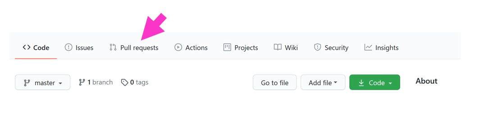
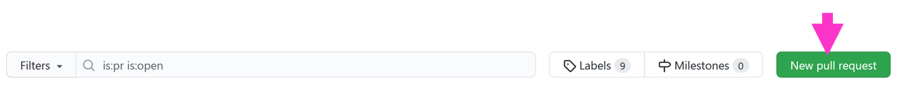
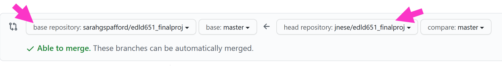
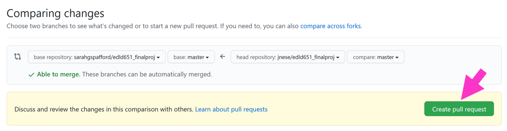
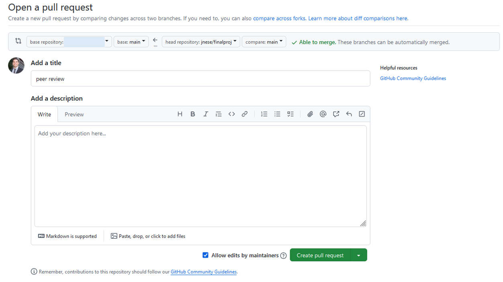

```{r setup, include=FALSE}
library(tidyverse)
library(knitr)
library(here)
library(janitor)
library(kableExtra)
library(palmerpenguins)
library(countdown)
library(DT)
library(reactable)
library(gtsummary)

source(here("nopublish", "colors.R"))

theme_set(theme_minimal())
```

# Thankful for you

extra credit

## Homework Review

Homework 9

# Factors & Pull Requests 

Week 9

## Agenda {.smaller}

* Final Project Review
* Discuss factors and factor re-leveling
* Walk through a [pull request (PR)]{style='color:#009E73'}

**Overall Purpose**

* Understand factors and how to manipulate them
* Understand how to complete a [pull request (PR)]{style='color:#009E73'}

## Your code!


# Final Project


## Final Project - Data Prep Script

* Expected to be a work in progress
* Provided to your peers so they can learn from you as much as you can learn from their feedback

**Peer Review**

* Understand the purpose of the exercise
* Conducted as a professional product
* Should be **very** encouraging 
* Zero tolerance policy for inappropriate comments

## Final Project – Presentation

* Groups are expected to present for about **15-20 minutes** (split evenly among members)

* Group order randomly assigned


## Final Project – Presentation

<b>Presentation cover the following:</b>

* Share your journey (everyone, at least for a minute or two)
* Discuss challenges you had along the way
* Celebrate your successes
* Discuss challenges you are still facing
* Discuss substantive findings
* Show off your cool figures!
* Discuss next `R` hurdle you want to address

## Final Project – Paper {.smaller}

* Quarto document
    + Abstract, Intro, Methods, Results, Discussion, References
    + Should be brief: 3,500 words max 
* No code displayed - should look similar to a manuscript being submitted for publication
* Include at least 1 table
* Include at least 2 plots
* Should be fully open, reproducible, and housed on GitHub
    + I should be able to clone your repository, open the R Studio Project, and reproduce the full manuscript (by rendering the quarto doc)

## Final Project

The following functions: 

* `pivot_longer()`
* `mutate()`
* `select()`
* `filter()`
* `pivot_wider()`
* `group_by()`
* `summarize()`

## Scoring Rubric

Check the [syllabus](https://jnese.github.io/intro-DS-R_fall-2025/syllabus.html) for the scoring rubrics for:

- [Presentation](https://jnese.github.io/intro-DS-R_fall-2025/syllabus.html#final-project-presentation-25-points) and 
- [Final Paper](https://jnese.github.io/intro-DS-R_fall-2025/syllabus.html#final-paper-110) 


# Factors

just the basics

## When do we really want factors?

Generally two reasons to declare a factor

1. Only finite number of categories
    + treatment/control
    + income categories
    + performance levels
    + months
    + etc.
  
2. Use in modeling

## Creating factors {.smaller}

Imagine you have a vector of months

```{r}
months_4 <- c("Dec", "Apr", "Jan", "Mar")
```

. . .

We could store this as a string, but there are issues with this:

* There are only 12 possible months
    + factors will help us weed out values that don't conform to our predefined levels, which helps safeguard against typos, etc.
* You can't sort this vector in a meaningful way
    + default is alphabetic sorting

. . .

```{r}
sort(months_4)
```

## Define it as a `factor()`

And hand enter the order of the levels

```{r}
months_4 <- factor(months_4, levels = c("Jan", "Feb", "Mar", "Apr", "May", "Jun", "Jul", "Aug", "Sep", "Oct", "Nov", "Dec"))
months_4
```

. . .

Now we can sort

```{r}
sort(months_4)
```

## Accessing and modifying levels {.smaller}

Use the `levels()` function

. . .

```{r}
levels(months_4)
```

## Provides an error check of sorts

```{r, warning=TRUE}
months_4[5] <- "Jam"
```

. . .

```{r}
months_4
```

## What if we don’t specify levels?

If you define a factor without specifying the levels, it will assign them alphabetically

```{r}
mnths <- factor(c("Dec", "Apr", "Jan", "Mar"))
```

. . .

```{r}
#| echo: false
mnths
```

## [`{forcats}`](https://forcats.tidyverse.org/) {width="10%"}

::: {.incremental}

* When working with factors, we can use the `{forcats}` package
    + `for cat`egorical variables
    + anagram of factors
    + best package name ever?
* Part of the `{tidyverse}` so should be good to go
* All functions start with `fct_`
    + use the autofill in RStudio

:::


## Change level order – `fct_inorder()`

By the order in which they first appear

```{r}
(simpsons <- factor(c("Homer", "Marge", "Bart", "Lisa", "Maggie")))
```

. . .

```{r}
simpsons |> 
  sort()
```

## Change level order – `fct_inorder()`

By the order in which they first appear

```{r}
(simpsons <- factor(c("Homer", "Marge", "Bart", "Lisa", "Maggie")))
```

. . .

```{r}
#| code-line-numbers: "|2"

simpsons |> 
  fct_inorder() |>
  sort()
```

## Change level order – `fct_infreq()`

By number of observations with each level (largest first)
 
```{r}
#| code-line-numbers: "|2"
c("b", "b", "c", "a", "a", "a") |> 
    fct_infreq() 
```

. . .

This can be **especially** useful for plotting

```{r eval=FALSE}
ggplot(aes(x, fct_infreq(y))
```


## Investigate factors

* `{tidyverse}` gives you convenient way to evaluate factors
    + `count()`
    + `geom_bar()` or `geom_col())` with `{ggplot2}`
* But don't forget about the base function `unique()`
    + e.g., `unique(df$factor_variable)`

## General Social Survey (GSS)

```{r}
forcats::gss_cat
```

## 

```{r}
gss_cat |> 
  count(partyid)
```

## 

```{r}
levels(gss_cat$partyid)
```

## 

```{r}
unique(gss_cat$partyid)
```

. . .

How many `unique` categories are there (if you have a lot)?

```{r}
length(unique(gss_cat$partyid))
```


##

```{r}
ggplot(gss_cat, aes(partyid)) +
    geom_bar()
```

##

```{r}
#| eval: false
ggplot(gss_cat, aes(fct_infreq(partyid))) +
    geom_bar()
```

ggplot(gss_cat, aes([fct_infreq(]{style='color:#CC79A7'}partyid[)]{style='color:#CC79A7'})) + <br> geom_bar()

. . .

```{r}
#| echo: false
ggplot(gss_cat, aes(fct_infreq(partyid))) +
    geom_bar()
```


## Change level order – `fct_relevel()`

Change level order by hand, or move any number of levels to any location

- *probably one I use most*

```{r eval=FALSE}
fct_relevel(variable_name, 
            "first_level", 
            "second_level", 
            "third_level", 
            ...)
```
<br>
```{r eval=FALSE}
fct_relevel(variable_name, 
            "fourth_level", 
            after = 3)
```


##

```{r}
#| code-line-numbers: "|1|2|3|4"
set.seed(3000)
tibble(
 month = c("Jan", "Feb", "Mar", "Apr", "May", "Jun", "Sep", "Oct", "Nov", "Dec"),
 suspensions = sample(c(5:75), size = 10)
)
```

##

```{r}
#| code-line-numbers: "|6,7"
#| output-location: fragment
set.seed(3000)
tibble(
 month = c("Jan", "Feb", "Mar", "Apr", "May", "Jun", "Sep", "Oct", "Nov", "Dec"),
 suspensions = sample(c(5:75), size = 10)
) |> 
  ggplot(aes(month, suspensions)) +
  geom_col() 
```

::: aside
default alphabetical order
:::

##

```{r eval=FALSE}
#| code-line-numbers: "|6|7"
#| output-location: fragment
set.seed(3000)
tibble(
 month = c("Jan", "Feb", "Mar", "Apr", "May", "Jun", "Sep", "Oct", "Nov", "Dec"),
 suspensions = sample(c(5:75), size = 10)
) |> 
  mutate(month = fct_relevel(month, 
                    "Sep", "Oct", "Nov", "Dec", "Jan", "Feb", "Mar", "Apr", "May")) 
```

##

```{r}
#| code-line-numbers: "|8,9"
#| output-location: fragment
set.seed(3000)
tibble(
 month = c("Jan", "Feb", "Mar", "Apr", "May", "Jun", "Sep", "Oct", "Nov", "Dec"),
 suspensions = sample(c(5:75), size = 10)
) |> 
  mutate(month = fct_relevel(month,
                    "Sep", "Oct", "Nov", "Dec", "Jan", "Feb", "Mar", "Apr", "May")) |> 
  ggplot(aes(month, suspensions)) + 
  geom_col() 
```

::: aside
custom order
:::

## Change level order – `fct_reorder()`

Reorder according to another variable

```{r}
(relig_summary <- gss_cat |>
  group_by(relig) |>
  summarise(tvhours = mean(tvhours, na.rm = TRUE),
            n = n()))
```

##

```{r}
ggplot(relig_summary, aes(tvhours, relig)) + 
  geom_point()
```

## `mutate()` the factor reorder

```{r}
#| code-line-numbers: "|2"
relig_summary |> 
  mutate(relig = fct_reorder(relig, tvhours)) |> 
  ggplot(aes(tvhours, relig)) + 
  geom_point()
```

## Or reorder within `ggplot()`

```{r, eval=FALSE}
ggplot(relig_summary, aes(tvhours, fct_reorder(relig, tvhours))) + 
  geom_point()
```

[fct_reorder(]{style='color:#CC79A7'}relig, [tvhours)]{style='color:#CC79A7'}) 
  
. . .

```{r, echo=FALSE}
ggplot(relig_summary, aes(tvhours, fct_reorder(relig, tvhours))) + 
  geom_point()
```

## Quick aside for error bars

```{r}
#| code-line-numbers: "|3|4,5|6"

(relig_summary_eb <- gss_cat |>
  group_by(relig) |>
  summarise(tvhours_mean = mean(tvhours, na.rm = TRUE),
            tvhours_se   = sqrt(var(tvhours, na.rm = TRUE) / 
                                  length(na.omit(tvhours))),
            n = n()))
```

## Quick aside for error bars

```{r fig.height=3}
#| code-line-numbers: "|1|2|3,4,5|6"
ggplot(relig_summary_eb, 
       aes(tvhours_mean, fct_reorder(relig, tvhours_mean))) + 
  geom_errorbarh(aes(xmin = tvhours_mean - 1.96 * tvhours_se,
                     xmax = tvhours_mean + 1.96 * tvhours_se),
                 color = "cornflowerblue") +
  geom_point()
```

## Modifying factor levels – `fct_recode()`

Make modifying factors more explicit

`fct_recode(var_name,` 

<p style="margin-left: 15px;">`"new level" = "old level"...`</p>

```{r, eval=FALSE}
#| code-line-numbers: "|2,3,4,5,6,7"
gss_cat |>
  mutate(partyid = fct_recode(partyid,
    "Republican, strong" = "Strong republican", 
    "Republican, weak" = "Not str republican", 
    "Independent, near rep" = "Ind, near rep", 
    "Independent, near dem" = "Ind, near dem", 
    "Democrat, weak" = "Not str democrat", 
    "Democrat, strong" = "Strong democrat")) |> 
  count(partyid)
```

## Collapsing levels – `fct_recode()` {.smaller}

`fct_recode()` can also be used to collapse levels easily

```{r}
#| code-line-numbers: "|3,4|5,6|7,8|9,10,11"
#| output-location: fragment
gss_cat |>
  mutate(partyid = fct_recode(partyid,
    "Republican"  = "Strong republican",
    "Republican"  = "Not str republican",
    "Independent" = "Ind,near rep",
    "Independent" = "Ind,near dem",
    "Democrat"    = "Not str democrat",
    "Democrat"    = "Strong democrat",
    "Other"       = "No answer", 
    "Other"       = "Don't know", 
    "Other"       = "Other party")) |> 
  count(partyid)
```

## Collapsing levels – `fct_collapse()` {.smaller}

`fct_collapse()` is one of the more useful functions in `{forcats}`

* Collapse all categories into `Republican`, `Democrat`, `Independent`, or `Other`

```{r}
#| code-line-numbers: "|2"
gss_cat |>
  mutate(partyid = fct_collapse(partyid, 
    	Other = c("No answer", "Don't know", "Other party"),
    	Rep = c("Strong republican", "Not str republican"),
    	Ind = c("Ind,near rep", "Independent", "Ind,near dem"),
    	Dem = c("Not str democrat", "Strong democrat")
  )) |>
  count(partyid)
```

## Collapsing levels – `fct_lump_?()`

`fct_lump_?()` – "lump" a bunch of categories together

`fct_lump_n(factor_variable, n)`
: lumps all levels except for the `n` most frequent (or least frequent if `n` < 0) into "Other" level

. . .

`fct_lump_min(factor_variable, min)`
: lumps levels that appear fewer than `min` times

. . .

`fct_lump_prop(factor_variable, prop)`
: lumps levels that appear in fewer `prop` $\times$ `n` times

## Collapsing levels – `fct_lump_n()`

Collapse to `n = 9` religious groups: top 8 groups plus "Other"

```{r}
#| code-line-numbers: "|2"
gss_cat |> 
  mutate(rel = fct_lump_n(relig, 9)) |> 
  count(rel) |> 
  arrange(rel)
```

## Collapsing levels – `fct_lump_min()`

Collapse to all religious groups that appear less than `min = 200` into `Other`

```{r}
#| code-line-numbers: "|2"
gss_cat |> 
  mutate(rel = fct_lump_min(relig, min = 200)) |> 
  count(rel) 
```

## Collapsing levels – `fct_lump_prop()`

Collapse to all religious groups that appear less than `prop = 10%` into `Other`

```{r}
#| code-line-numbers: "|2"
gss_cat |> 
  mutate(rel = fct_lump_prop(relig, prop = .10)) |> 
  count(rel) 
```

## Missing levels {.smaller}

```{r}
levels(gss_cat$race)
```

. . .

```{r}
gss_cat |> 
  count(race)
```

. . .

```{r}
table(gss_cat$race)
```

## Missing levels

```{r}
ggplot(gss_cat, aes(race)) +
    geom_bar()
```

## Missing levels

```{r}
#| code-line-numbers: "3"
ggplot(gss_cat, aes(race)) +
    geom_bar() +
    scale_x_discrete(drop = FALSE) 
```

## Review {.smaller}

::: {.incremental}

`fct_inorder()`
: By the order in which they first appear

`fct_infreq()`
: By number of observations with each level (largest first)

`fct_relevel()`
: Change level order by hand, or move any number of levels to any location

`fct_reorder()`
: Change level order according to another variable

`fct_recode()`
: Recode levels into new named levels

`fct_collapse()` 
: Collapse many levels into fewer levels

`fct_lump_?()`
: Recode all levels into "*Other*":

: `fct_lump_n()` - except for the `n` most frequent
: `fct_lump_min()` - that appear fewer than `min` times
: `fct_lump_prop()` - that appear less than `prop`%

:::


# Revisiting git

## Let's revisit git

Talk with neighbor. What do these terms mean?

Talk about them in the order you would encounter them in your workflow 

* [clone]{style='color:#009E73'}
* [pull]{style='color:#009E73'}
* [stage]{style='color:#009E73'}
* [commit]{style='color:#009E73'}
* [push]{style='color:#009E73'}
* [repo]{style='color:#009E73'}
* [remote]{style='color:#009E73'}

```{r, echo=FALSE}
countdown(minutes = 3, seconds = 0, bottom = 0, warn_when = 30)
```

# Pull Requests 

## Peer Review of Data Prep Script {.smaller}

Expectations

Feedback:

1. Note <u>at least 3</u> areas of strength
2. Note <u>at least 1</u> thing you learned from reviewing their script
3. Note <u>at least 1 and no more than 3</u> areas for improvement

. . .

Making your code publicly available can feel daunting 

* The purpose of this portion of the final project is to help us all learn from each other
* We are all learning
    + Be constructive in your feedback
    + Be kind
* Under no circumstances will negative comments be tolerated 
    + Any comments that could be perceived as negative, and outside the scope of the code, will result in an immediate score of zero
  
## Peer Review GitHub Process {.smaller}

1. Locate GitHub [repo]{style='color:#009E73'} of assigned peer to review
2. Fork the [repo]{style='color:#009E73'}
3. Clone the [repo]{style='color:#009E73'}
4. Provide script feedback
    i. edit the .qmd file directly
    ii. edit code
    iii. provide comments in code and/or text (`Ctrl/Command + Shift + C`)
5. [commit]{style='color:#009E73'} & [push]{style='color:#009E73'}!
6. Create [Pull Request (PR)]{style='color:#009E73'}

* Write brief summary uisng `markdown` of the PR that includes
  + \>= 3 strengths
  + \>= 1 thing you learned
  + 1 to 3 three areas of improvement

## 1. Locate GitHub repo of assigned peer to review {.smaller}

```{r echo=FALSE}
roster <- readxl::read_xlsx(here::here("nopublish", "groups.xlsx")) |> 
  mutate(Student = paste(first, last))

random_draw <- function(x){
  repeat{
    groups <- as.character(x$group)
    x$samp <- sample(groups, replace = FALSE)
    x$check <- (x$group == x$samp)
    if (sum(x$check) == 0) break
  }
  return(x)
}

set.seed(651)
peer_review <- random_draw(roster)

peer_review_tbl <- peer_review |> 
  select(Student, group = samp) |> 
  left_join(
    roster |> 
      select(group, git_page, file) |> 
      distinct()
  ) |> 
  select(Student, `Repo to Review` = git_page, `File to Review` = file) 

peer_review_tbl |> 
  kable() |> 
  kable_styling(font_size = 12)

write_csv(peer_review_tbl, here::here("nopublish", "peer_review_tbl.csv"))
```

## {.smaller}

```{r}
#| echo: false
peer_review |> 
  select(Student, group = samp) |> 
  left_join(
    roster |> 
      select(group, git_page, file) |> 
      distinct()
  ) |> 
  select(Student, `Repo to Review` = git_page, `File to Review` = file) |> 
  DT::datatable()
```


## 2. Fork the repo

1. Navigate to the (host) GitHub repo
2. Click Fork in the upper right corner
3. Owner? – **your GitHub account**



## 3. Clone the repo 

(@) Clone the repo

copy the URL


## 3. Clone the repo 

(@) Open GitKraken

*Clone with URL*

Where will it live on your local machine? It's own folder, with no other RProjects

  

## 4. Provide script feedback {.smaller}

* Open `RProj` in your [local]{style='color:#009E73'} (i.e., on your machine)
* Find the .qmd document you will be reviewing
   + it should be a .qmd document
* Make your edits/comments
    i. edit code as you like
    ii. include a comment for each edit!
    iii. Provide comments in code **and/or** text (`Ctrl/Command + Shift + C`)
* Commit as you go (if you are working on this across sessions/days)
* [Push]{style='color:#009E73'} **only when you are finished**

## 5. [commit]{style='color:#009E73'} & [push]{style='color:#009E73'}

Once you have provided comments and code suggestions to the script

- save the changes
- go to GitKraken
- [commit]{style='color:#009E73'}
- [push]{style='color:#009E73'}

## 5. Create Pull Request (PR) {.smaller}

(1) Navigate back to the (host) GitHub repo

. . .

(2) Click “Pull requests”



. . .

(3) Click “New pull request”



## 6. Create Pull Request (PR) {.smaller}

(4) Click *"Compare across forks"*


. . .

Use drop-downs so that:

*  **left** = `host` repo
*  **right**  = `your` repo


. . .

You will be able view the changes you made to the .qmd document

## 6. Create Pull Request (PR)

(5) Click *"Create pull request"*



## 6. Create Pull Request (PR) {.smaller}

Write a brief summary list of the PR that includes

* \>= 3 strengths
* \>= 1 thing you learned
* 1 to 3 three areas of improvement
* **Use markdown formatting**
    + headers
    + lists
    + bold/italics



## 6. Create Pull Request (PR)

(6) Click *"Create pull request"* when you're done


## 6. Create Pull Request (PR) {.smaller}

Recap

(@) Navigate back to the (host) GitHub repo
(@) Click *"Pull requests"*
(@) Click *"New pull request"*
(@) Click *"Compare across forks"*
    * Use drop-downs so that:
        + Host [repo]{style='color:#009E73'} is on the left, your [repo]{style='color:#009E73'} is on the right
    * View changes!
(@) Click *"Create pull request"*
    * Write brief summary list of the [PR]{style='color:#009E73'} that includes
        + \>= 3 strengths
        + \>= 1 thing you learned
        + 1 to 3 three areas of improvement
        + **Use markdown formatting, headers, or list!**

(@) Click *"Create pull request"*

## Reviewing your PRs

You will get an email from GitHub

1. Click on first link, for [PR]{style='color:#009E73'}
2. Click *"Commits"* tab
3. Click on *"File changes"* to see changes
4. Copy/paste all desired changes
5. Don’t close *"Close PR"* just yet; I want to review

# Next time

## Before next class

* Final Project
    + [Final Project: Peer Review of Script]{style='color:#FF0000'}
    + [Final Project: Presentations]{style='color:#FF0000'} - email me your content before class
* Homework
    + **Homework 10**
* Ask Me Anything (AMA)
    + R stuff
    + Professional/Career stuff


